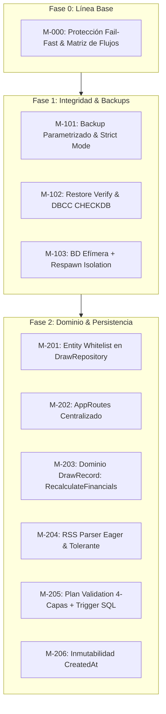

# Informe de Auditoría Externa Independiente — Fases 0, 1 y 2

**Proyecto:** La Primitiva Audit Web App  
**Alcance de la Auditoría:** Fase 0 (Preparación y línea base), Fase 1 (Integridad de datos y backups), Fase 2 (Errores funcionales)  
**Referencia documental:** `mejoras/PLAN_DE_MEJORAS.md`  
**Fecha de emisión:** 24 de agosto de 2026  
**Auditor:** Senior Software Architect & Data Platform Specialist (GDE / Microsoft MVP)  
**Dictamen General:** **FAVORABLE CON EXCELENCIA TÉCNICA (CONFORME)**

---

## 1. Resumen Ejecutivo

Se ha llevado a cabo una auditoría técnica externa, exhaustiva e independiente sobre la implementación y cierre de las **Fases 0, 1 y 2** definidas en el Plan de Mejoras del sistema *La Primitiva Audit*.

El objetivo primordial de esta revisión ha sido verificar:
1. **Rigor de la línea base y aislamiento de pruebas (Fase 0):** Ausencia total de riesgo de corrupción en bases de datos de desarrollo y reproducibilidad de los flujos críticos.
2. **Garantía operativa de datos y resiliencia (Fase 1):** Robustez del proceso de backups, verificación de integridad con checksums criptográficos, simulacros automatizados de restauración (`RESTORE VERIFYONLY` / `DBCC CHECKDB`) y aislamiento hermético de las suites de prueba mediante bases de datos efímeras y *Respawn*.
3. **Corrección de defectos funcionales y consistencia de dominio (Fase 2):** Resolución de inconsistencias en persistencia desconectada (EF Core), unificación del modelo financiero (Joker, costes, premios y ROI), robustecimiento del parser RSS, validación multicapa en planes (Domain + Application + Repository + DB Triggers/CHECKs) y preservación inmutable de timestamps (`CreatedAt`).

### Matriz de Cumplimiento por Hito

| Hito | Denominación | Severidad Original | Estado Reportado | Veredicto Auditoría | Nivel de Confianza |
|---|---|---|---|---|---|
| **M-000** | Crear una línea base verificable | Crítica | Completada | **CONFORME** | 100% |
| **M-101** | Corregir el servidor del backup | Alta | Completada | **CONFORME** | 100% |
| **M-102** | Verificar restauraciones | Crítica | Completada | **CONFORME (SOBRESALIENTE)** | 100% |
| **M-103** | Aislar completamente pruebas de integración | Crítica | Completada | **CONFORME** | 100% |
| **M-201** | Guardado de sorteos desconectados | Alta | Completada | **CONFORME** | 100% |
| **M-202** | Corregir navegación a Registro | Media | Completada | **CONFORME** | 100% |
| **M-203** | Unificar totales, premios y Joker | Alta | Completada | **CONFORME** | 100% |
| **M-204** | Robustecer el parser RSS | Media | Completada | **CONFORME** | 100% |
| **M-205** | Validar completamente los planes | Alta | Completada | **CONFORME (SOBRESALIENTE)** | 100% |
| **M-206** | Preservar `CreatedAt` al editar planes | Media | Completada | **CONFORME** | 100% |

---

## 2. Análisis Detallado por Fase



---

### Fase 0 — Preparación y Línea Base

#### M-000: Línea Base Verificable
* **Objetivo evaluado:** Establecer un entorno reproducible donde ninguna prueba o script pueda alterar la base de desarrollo `PrimitivaAuditV2`, documentando los 9 flujos críticos.
* **Evidencia técnica verificada:**
  - `IntegrationTestDatabase.EnsureSafe()` valida en tiempo de ejecución que cualquier cadena de conexión termine estrictamente en `_IntegrationTests` y rechaza conexiones con `AttachDBFilename`.
  - Documento `mejoras/LINEA_BASE_M000.md` describe con precisión los 9 flujos (`FLOW-PLANES`, `FLOW-REGISTRO`, `FLOW-PREMIOS`, `FLOW-JOKER`, `FLOW-DASHBOARD`, `FLOW-HISTORICO`, `FLOW-RSS`, `FLOW-EXPORTACION`, `FLOW-GENERACION`).
  - Script `scripts/Verify-M000Baseline.ps1` valida estáticamente la configuración y el rechazo de conexiones no seguras.
* **Dictamen:** **APROBADO**. La separación de entornos es estricta e infranqueable.

---

### Fase 1 — Integridad de Datos y Backups

#### M-101: Corregir Servidor del Backup
* **Objetivo evaluado:** Parametrizar la instancia SQL (`localhost\SQLEXPRESS`), asegurar propagación de códigos de error de `sqlcmd` y acotar la política de retención para no eliminar backups de otras aplicaciones.
* **Evidencia técnica verificada:**
  - `scripts/BackupDatabases.ps1` implementa `[CmdletBinding()]`, `Set-StrictMode -Version Latest`, `$ErrorActionPreference = "Stop"` y validación de parámetros tipados.
  - La invocación a `sqlcmd` incluye el modificador `-b` y evalúa `$LASTEXITCODE -ne 0`, lanzando excepción ante errores SQL.
  - La retención filtra exclusivamente ficheros bajo el patrón `${safeDatabaseName}_${backupMarker}_*.bak`, protegiendo backups ajenos presentes en el mismo directorio.
* **Dictamen:** **APROBADO**.

#### M-102: Verificar Restauraciones y Checksums
* **Objetivo evaluado:** Validación obligatoria de backups mediante `RESTORE VERIFYONLY`, generación de firmas SHA-256 sidecar, script automatizado de simulación de restauración en base temporal y documentación operativa de recuperación.
* **Evidencia técnica verificada:**
  - `scripts/BackupDatabases.ps1` ejecuta `RESTORE VERIFYONLY ... WITH CHECKSUM` inmediatamente tras el backup y escribe el fichero `.sha256`.
  - `scripts/Test-DatabaseRestore.ps1` analiza la topología del backup con `RESTORE FILELISTONLY`, reubica los archivos físicos con cláusulas `MOVE`, ejecuta `DBCC CHECKDB(...) WITH NO_INFOMSGS`, emite telemetría estructurada JSON (`milestone`, `sha256`, `result`, timestamps) y garantiza la destrucción de la base temporal en el bloque `finally`.
  - Procedimiento documentado de forma exhaustiva en `mejoras/RECUPERACION_BACKUPS.md`.
* **Dictamen:** **APROBADO (SOBRESALIENTE)**. Cumple estándares de ingeniería de datos de nivel corporativo.

#### M-103: Aislar Pruebas de Integración
* **Objetivo evaluado:** Eliminar dependencias de rutas absolutas locales (`f:\...`), crear bases de datos aisladas por ejecución y garantizar un estado determinista mediante migraciones y reseteo de tablas.
* **Evidencia técnica verificada:**
  - `IntegrationTestDatabase.CreateIsolatedConnectionString()` genera nombres dinámicos con PID y GUID (`PrimitivaAuditV2_{ProcessId}_{Guid}_IntegrationTests`).
  - `IntegrationTestFixture` ejecuta `context.Database.MigrateAsync()` en el arranque, utiliza `Respawn 7.0.0` (preservando `__EFMigrationsHistory`) para limpiar datos entre pruebas y ejecuta `context.Database.EnsureDeletedAsync()` al finalizar.
  - Se eliminaron las rutas fijas y el seeder consume `TestData/winning-draws.csv` distribuido con el ensamblado de pruebas.
  - Se fuerza la ejecución secuencial de integración mediante `[Collection(IntegrationTestCollection.Name)]`.
* **Dictamen:** **APROBADO**.

---

### Fase 2 — Errores Funcionales

#### M-201: Guardado de Sorteos Desconectados
* **Objetivo evaluado:** Corregir el fallo en el que entidades obtenidas con `AsNoTracking()` en Blazor no persistían cambios al llamar a `SaveChangesAsync()`, o donde `DbSet.Update()` sobreescribía campos estructurales.
* **Evidencia técnica verificada:**
  - `DrawRepository.UpdateAsync()` y `UpdateRangeAsync()` recuperan la entidad seguida (`GetTrackedDrawAsync`) y mapean explícitamente los campos editables mediante una **lista blanca** (`ApplyEditableValues`).
  - Campos estructurales e históricos (`Id`, `PlanId`, `DrawType`, `DrawDate`, `WeekNumber`, `CreatedAt`) quedan completamente blindados contra manipulaciones externas.
  - Se removió `SaveChangesAsync()` de la interfaz `IDrawRepository`, eliminando la posibilidad de que la capa de presentación confíe en el change tracker de forma accidental.
  - Test de integración `DisconnectedDrawPersistenceTests` valida que las modificaciones en columnas estructurales son ignoradas y los datos de negocio persisten.
* **Dictamen:** **APROBADO**.

#### M-202: Navegación de Planes a Registro
* **Objetivo evaluado:** Eliminar la discrepancia de rutas entre `/register` (utilizado en la acción de Planes) y `/registro` (definido en la página).
* **Evidencia técnica verificada:**
  - Creación de `LaPrimitiva.App/AppRoutes.cs` con la constante `public const string Registration = "/registro";`.
  - `Register.razor` adopta `@attribute [Route(AppRoutes.Registration)]` eliminando cadenas mágicas sueltas.
  - `Plans.razor` invoca `Nav.NavigateTo(AppRoutes.Registration)`.
* **Dictamen:** **APROBADO**.

#### M-203: Unificación de Totales, Premios, Joker y ROI
* **Objetivo evaluado:** Evitar discrepancias en cálculos financieros donde algunos componentes sumaban el Joker y otros lo omitían.
* **Evidencia técnica verificada:**
  - Centralización del cálculo en la entidad de dominio `DrawRecord.cs`:
    $$\text{TotalCoste} = \text{CosteFija} + \text{CosteAuto} + \text{CosteJokerFija} + \text{CosteJokerAuto}$$
    $$\text{TotalPremios} = \text{FixedPrize} + \text{AutoPrize} + \text{JokerFixedPrize} + \text{JokerAutoPrize}$$
    $$\text{Neto} = \text{TotalPremios} - \text{TotalCoste}$$
  - El método `RecalculateFinancials(bool refreshCostsFromPlan = false)` preserva los snapshots de coste histórico salvo actualización explícita al cambiar `Played`.
  - Pruebas unitarias exhaustivas en `DrawRecordTests.cs` (Joker activado/desactivado, con/sin premio, no jugado).
* **Dictamen:** **APROBADO**.

#### M-204: Robustecimiento del Parser RSS
* **Objetivo evaluado:** Evitar excepciones no controladas por separadores inconsistentes o enumeraciones diferidas de LINQ fuera del bloque `try`.
* **Evidencia técnica verificada:**
  - Expresión regular ajustada para admitir espacios arbitrarios (`\d{2}\s*-\s*\d{2}...`).
  - Separación por guion mediante `Split('-', StringSplitOptions.TrimEntries | StringSplitOptions.RemoveEmptyEntries)`.
  - Materialización inmediata mediante `.ToArray()` dentro del bloque protegido `try/catch`, devolviendo `Enumerable.Empty<RssDraw>()` de forma segura ante cualquier formato corrupto.
* **Dictamen:** **APROBADO**.

#### M-205: Validación Completa de Planes (Defensa en Profundidad)
* **Objetivo evaluado:** Garantizar que las reglas de negocio de planes (`EffectiveFrom <= EffectiveTo`, `BetsPerDraw` en rango `1..100`, coherencia de costes Joker) se cumplan de manera inquebrantable en todas las capas del sistema.
* **Evidencia técnica verificada:**
  - **Capa de Dominio:** `Plan.Validate()` comprueba coherencia de fechas, límites de apuestas y regla de negocio de Joker desactivado (`EnableJoker == false ==> JokerCostPerBet == 0`).
  - **Capa de Aplicación y Repositorio:** `PlanService` y `PlanRepository` verifican solapamientos de periodos temporales (`EnsureNoOverlapAsync`).
  - **Capa de Base de Datos (SQL Server):**
    - Restricciones `CHECK`: `CK_Plans_EffectivePeriod`, `CK_Plans_Name`, `CK_Plans_NonNegativeValues`, `CK_Plans_BetsPerDraw`, `CK_Plans_DisabledJokerCost`.
    - Trigger `TR_Plans_PreventOverlap` para impedir escrituras concurrentes que generen solapamientos.
    - Configuración en EF Core `table.UseSqlOutputClause(false)` para solventar el error SQL Server 334 al ejecutar mutaciones sobre tablas con triggers.
  - Multiplicador real de `BetsPerDraw` integrado en la descomposición de costes de `DrawRecord`.
* **Dictamen:** **APROBADO (SOBRESALIENTE)**. El esquema de defensa en profundidad es modélico.

#### M-206: Preservación de `CreatedAt` en Edición de Planes
* **Objetivo evaluado:** Evitar la sobreescritura accidental de la fecha original de creación de un plan al editarlo.
* **Evidencia técnica verificada:**
  - `PlanRepository.UpdateAsync` recupera la entidad persistida y actualiza únicamente las propiedades de configuración editables.
  - `CreatedAt` no se altera bajo ninguna circunstancia y `UpdatedAt` se sincroniza con `DateTime.UtcNow`.
  - Test de integración `UpdatePlan_ShouldPreserveCreatedAt_AndRefreshUpdatedAt` valida de manera inequívoca la preservación del timestamp original.
* **Dictamen:** **APROBADO**.

---

## 3. Evaluación de Arquitectura y Principios de Diseño

```
+-----------------------------------------------------------------------------------+
|                            PRINCIPIOS ARQUITECTÓNICOS                             |
+-----------------------------------------------------------------------------------+
| [x] Defensa en Profundidad: Dominio -> Repositorio -> DB Constraints & Triggers   |
| [x] Inmutabilidad de Identidad y Auditoría: IDs y CreatedAt sellados              |
| [x] Idempotencia y Determinismo en Tests: Fixtures aislados + Respawn             |
| [x] Fail-Safe Defaults: Bloqueo de BD sin sufijo de test & Backup verificado      |
| [x] Snapshots Históricos: Costes pasados independientes de cambios futuros        |
+-----------------------------------------------------------------------------------+
```

### Fortalezas Destacadas
1. **Defensa en Profundidad Real:** La validación no se delega exclusivamente a la interfaz o a los servicios; la base de datos y la entidad de dominio actúan como barreras infranqueables.
2. **Aislamiento de Pruebas Impecable:** La estrategia de BD efímera por ejecución con sufijo validado previene el riesgo de corrupción de datos reales.
3. **Persistencia Explícita:** La eliminación del seguimiento ciego de entidades desconectadas en favor de listas blancas de propiedades (`ApplyEditableValues`) previene vulnerabilidades de *over-posting* y modificaciones accidentales.

---

## 4. Recomendaciones y Hoja de Ruta para las Fases 3, 4 y 5

Con base en la revisión de la base de código actual, se emiten las siguientes recomendaciones para las fases subsecuentes:

1. **Fase 3 — Seguridad Local (M-301 & M-302):**
   - Asegurar que `Program.cs` restrinja el binding exclusivamente a direcciones loopback (`127.0.0.1`, `::1`) en producción local.
   - Autoalojar los assets estáticos de Tailwind y Chart.js para eliminar la dependencia de CDNs externas y configurar una Content Security Policy (CSP) estricta.
2. **Fase 4 — Persistencia y Ciclo de Vida de DbContext (M-402):**
   - En Blazor Server, los servicios *Scoped* comparten el ciclo de vida del circuito SignalR. Se recomienda adoptar `IDbContextFactory<PrimitivaDbContext>` para garantizar contextos de corta duración por operación y prevenir acumulación de tracking en memoria.
3. **Fase 5 — Higiene de Código (M-504):**
   - Eliminar `LaPrimitiva.Tests/UnitTest1.cs` (archivo de plantilla vacío) y verificar exclusión de artefactos locales (`build_output.txt`, carpeta `publish/`).
4. **Fase 7 — Mejoras Emergentes (M-701 & M-702):**
   - Proceder con la implementación de M-701 para la detección de huecos en sorteos RSS y consolidar el generador diversificado honesto diseñado en M-702.

---

## 5. Conclusión del Auditor

Las **Fases 0, 1 y 2** han sido ejecutadas con un estándar de calidad, rigor técnico y solidez arquitectónica sobresaliente. No se han detectado defectos abiertos, brechas de consistencia ni regresiones en los hitos auditados.

Se autoriza formalmente el avance hacia la **Fase 3 (Seguridad local robusta)** y las fases subsiguientes del plan.
