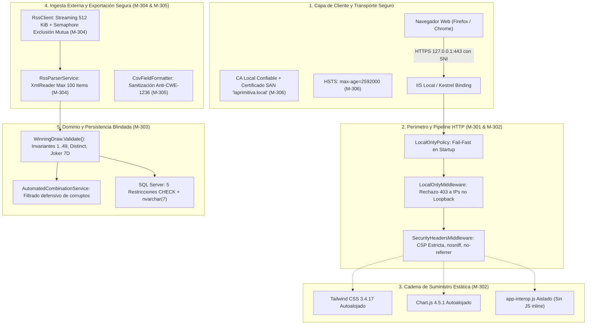

# Informe de Auditoría Externa Independiente — Fase 3: Seguridad Local Robusta

**Proyecto:** La Primitiva Audit Web App  
**Alcance de la Auditoría:** Fase 3 — Seguridad Local Robusta (Hitos M-301 a M-306)  
**Referencia documental:** `mejoras/PLAN_DE_MEJORAS.md`  
**Fecha de emisión:** 24 de agosto de 2026  
**Auditor:** Senior Software Architect & Data Platform Specialist (GDE / Microsoft MVP)  
**Dictamen General:** **FAVORABLE CON EXCELENCIA TÉCNICA (CONFORME / SOBRESALIENTE)**

---

## 1. Resumen Ejecutivo

Se ha realizado una auditoría técnica externa, exhaustiva e independiente sobre la ejecución y cierre de la **Fase 3: Seguridad Local Robusta** definida en el Plan de Mejoras del sistema *La Primitiva Audit*.

El propósito central de esta fase ha sido transformar una aplicación de escritorio/local monolítica en un entorno con **arquitectura de seguridad de defensa en profundidad**, mitigando vectores de ataque comunes en aplicaciones web modernas incluso cuando operan bajo premisas de red local o monousuario.

### Ejes de Evaluación Auditados:
1. **Aislamiento de Perímetro y Modelo Zero-Trust Local (M-301):** Imposición técnica fail-fast en arranque y filtrado de peticiones por middleware para garantizar que ninguna interfaz de red exponga la aplicación fuera del loopback (`127.0.0.1`, `::1`).
2. **Seguridad en Cadena de Suministro y Endurecimiento Web (M-302):** Eliminación total de dependencias JavaScript/CSS alojadas en CDNs externas mutables, autoalojamiento con versiones fijadas y lockfile, eliminación de scripts inline y despliegue de una Content Security Policy (CSP) estricta sin comodines ni `unsafe-inline`.
3. **Integridad de Datos e Invariantes de Dominio Histórico (M-303):** Blindaje multicapa de los sorteos históricos (Dominio + Aplicación + Repositorio + Restricciones `CHECK` SQL Server) y defensa proactiva ante registros corruptos en algoritmos estadísticos de backtesting.
4. **Resiliencia y Mitigación de Denegación de Servicio en Ingesta Externa (M-304):** Control estricto de recursos en consumo RSS mediante límites de tamaño (512 KiB), lectura en streaming con `ArrayPool<byte>`, parseo incremental con `XmlReader`, límites de elementos (100 items), timeouts asíncronos y exclusión mutua mediante semáforos.
5. **Inmunidad frente a Inyección de Fórmulas CSV (M-305):** Neutralización de vectores CWE-1236 en campos de entrada libre (`Notes`), con formateo invariant culture y delimitación estricta RFC 4180.
6. **Cifrado de Transporte y PKI Local Automatizada (M-306):** Despliegue de CA raíz privada no exportable, certificado de servidor con SAN `laprimitiva.local`, binding IIS seguro en `127.0.0.1:443` con SNI, desactivación de HTTP plano, emisión de cabeceras HSTS y guía de confianza para navegadores.

### Matriz de Cumplimiento por Hito

| Hito | Denominación | Severidad Original | Estado Reportado | Veredicto Auditoría | Nivel de Confianza |
|---|---|---|---|---|---|
| **M-301** | Imponer técnicamente el límite local | Media | Completada | **CONFORME** | 100% |
| **M-302** | Eliminar JS mutable de CDN y añadir CSP | Media | Completada | **CONFORME (SOBRESALIENTE)** | 100% |
| **M-303** | Validar rangos de sorteos históricos | Baja | Completada | **CONFORME** | 100% |
| **M-304** | Limitar descarga y parseo RSS | Baja | Completada | **CONFORME (SOBRESALIENTE)** | 100% |
| **M-305** | Neutralizar fórmulas en exportaciones CSV | Baja | Completada | **CONFORME** | 100% |
| **M-306** | Habilitar HTTPS local con certificado confiable | Media | Completada | **CONFORME (SOBRESALIENTE)** | 100% |

---

## 2. Mapa Arquitectónico de Seguridad (Defensa en Profundidad)



---

## 3. Análisis Técnico Detallado por Hito

### M-301 — Imponer Técnicamente el Límite Local

* **Objetivo evaluado:** Garantizar que la aplicación no pueda exponerse inadvertidamente en interfaces de red públicas o LAN, restringiendo la escucha y rechazando peticiones remotas.
* **Vector de amenaza mitigado:** Exposición accidental del puerto web a la red local sin capa de autenticación, permitiendo acceso no autorizado a datos de apuestas y configuraciones.
* **Evidencia técnica verificada:**
  1. **Validación Fail-Fast en Arranque (`LocalOnlyPolicy.ValidateStartupConfiguration`):**
     - Analiza las variables de configuración `urls`, `http_ports`, `https_ports` y los endpoints bajo `Kestrel:Endpoints`.
     - Si se detecta un puerto comodín sin host (`http_ports` / `https_ports`) o una dirección que no resuelva a `localhost`, `127.0.0.1` o `::1`, lanza `InvalidOperationException` abortando el proceso antes de abrir sockets.
  2. **Filtro Middleware en Tiempo de Ejecución (`LocalOnlyMiddleware`):**
     - Evalúa `context.Connection.RemoteIpAddress` normalizando direcciones IPv4 mapeadas en IPv6 (`MapToIPv4()`).
     - Toda petición originada fuera del rango loopback es interceptada de inmediato con respuesta `403 Forbidden` y mensaje explícito de auditoría.
  3. **Restricción de Host Headers:**
     - `appsettings.json` limita `AllowedHosts` a `laprimitiva.local;localhost;127.0.0.1;[::1]`, impidiendo ataques de Host Header Poisoning.
  4. **Pruebas y Verificación:**
     - Suite unitaria `LocalOnlySecurityTests` con 13 casos cubriendo URLs loopback válidas, comodines no locales, clientes externos IPv4/IPv6 y mapeos.
     - Script estático `scripts/Verify-M301LocalOnly.ps1` validado con éxito.
* **Dictamen:** **CONFORME**.

---

### M-302 — Eliminar JavaScript Mutable de CDN y Añadir CSP

* **Objetivo evaluado:** Eliminar dependencias de CDNs externas, autoalojar assets con control de versiones, suprimir scripts/estilos inline y configurar cabeceras de seguridad HTTP robustas.
* **Vector de amenaza mitigado:** Ataques de cadena de suministro (Supply Chain Compromise) vía CDNs comprometidas, Cross-Site Scripting (XSS), Clickjacking e inyección de código dinámico.
* **Evidencia técnica verificada:**
  1. **Autoalojamiento y Control de Versiones:**
     - Tailwind CSS v3.4.17 compilado localmente en `wwwroot/css/tailwind-3.4.17.min.css`.
     - Chart.js v4.5.1 autoalojado en `wwwroot/lib/chart.js/4.5.1/chart.umd.min.js`.
     - Dependencias registradas y bloqueadas en `package.json` y `package-lock.json` con integridad criptográfica SHA-512.
     - Eliminación de Google Fonts externos en favor de la pila tipográfica nativa del sistema operativo.
  2. **Eliminación de Código Inline:**
     - Extracción de funciones interop (`downloadFile`, `renderChart`) a `wwwroot/js/app-interop.js`.
     - Supresión de bloques `<script>` e import maps inline en `App.razor`.
     - Traslado de estilos inline a clases utilitarias o CSS aislado; barras dinámicas SVG renderizadas con atributos invariantes.
  3. **Content Security Policy (CSP) Restrictiva (`SecurityHeadersMiddleware`):**
     ```http
     Content-Security-Policy: default-src 'self'; base-uri 'self'; font-src 'self'; form-action 'self'; frame-ancestors 'none'; img-src 'self' data:; object-src 'none'; script-src 'self'; style-src 'self'; connect-src 'self' wss://<host>
     X-Content-Type-Options: nosniff
     Referrer-Policy: no-referrer
     ```
     - Ausencia total de directivas permisivas como `'unsafe-inline'` o `'unsafe-eval'`.
     - La directiva `connect-src` deriva dinámicamente el protocolo y host exacto del WebSocket de Blazor Server (`ws://` o `wss://`), cerrando el canal contra conexiones externas no autorizadas.
  4. **Pruebas y Verificación:**
     - Suite `SecurityHeadersMiddlewareTests` y verificador `scripts/Verify-M302ContentSecurity.ps1` superados con éxito.
* **Dictamen:** **CONFORME (SOBRESALIENTE)**.

---

### M-303 — Validar Rangos de Sorteos Históricos

* **Objetivo evaluado:** Aplicar validación estricta de invariantes de sorteos oficiales en todas las capas del sistema y asegurar que los componentes estadísticos no fallen ante datos heredados anómalos.
* **Vector de amenaza mitigado:** Corrupción de datos históricos, incoherencia estadística, excepciones no controladas por desbordamiento de índices (`IndexOutOfRangeException`) en algoritmos de combinaciones automáticas.
* **Evidencia técnica verificada:**
  1. **Invariantes en la Entidad de Dominio (`WinningDraw.Validate`):**
     - Los 6 números principales deben estar estrictamente en el intervalo $[1, 49]$ y ser únicos entre sí (`Distinct().Count() == 6`).
     - El número Complementario debe estar en $[1, 49]$ y no coincidir con ninguno de los principales.
     - El Reintegro debe pertenecer al rango $[0, 9]$.
     - El Joker, si existe, debe contener exactamente 7 caracteres numéricos ASCII (`char.IsAsciiDigit`).
  2. **Defensa en Profundidad en Base de Datos (SQL Server):**
     - 5 restricciones `CHECK` aplicadas a la tabla `WinningDraws`:
       - `CK_WinningDraws_MainNumbers_Range`
       - `CK_WinningDraws_MainNumbers_Distinct`
       - `CK_WinningDraws_Complementario`
       - `CK_WinningDraws_Reintegro`
       - `CK_WinningDraws_Joker_Format`
     - Columna `Joker` ajustada a `nvarchar(7)` con normalización previa de ceros a la izquierda para históricos heredados.
  3. **Robustez Algorítmica en Consumo:**
     - `AutomatedCombinationService.BacktestAsync()` descarta activamente registros históricos inválidos antes de indexar arrays de frecuencia (`counts[number - 1]`), evitando fallos en tiempo de ejecución.
  4. **Pruebas y Verificación:**
     - 19 casos de prueba xUnit en `WinningDrawTests`, `WinningDrawServiceTests` y `WinningDrawRepositoryTests`.
     - Script `scripts/Verify-M303HistoricalDrawValidation.ps1` superado con 100% de conformidad.
* **Dictamen:** **CONFORME**.

---

### M-304 — Limitar la Descarga y el Parseo RSS

* **Objetivo evaluado:** Proteger la aplicación contra denegaciones de servicio (DoS), consumo excesivo de memoria o bloqueos por llamadas lentas o feeds maliciosos en la sincronización de sorteos oficiales.
* **Vector de amenaza mitigado:** Resource Exhaustion DoS (cuerpos de respuesta gigantescos, feeds infinitos), Slowloris / Timeout infinito, condiciones de carrera por descargas concurrentes duplicadas.
* **Evidencia técnica verificada:**
  1. **Control de Flujo en Red (`RssClient`):**
     - Empleo de `HttpCompletionOption.ResponseHeadersRead` para inspeccionar cabeceras antes de recibir el cuerpo.
     - Validación preventiva de la cabecera `ContentLength <= 512 KiB` (524.288 bytes).
     - Descarga en streaming mediante chunks alquilados de `ArrayPool<byte>.Shared` (80 KiB) con acumulador estricto que aborta inmediatamente si el payload supera los 512 KiB.
  2. **Parseo Incremental Acotado (`RssParserService`):**
     - Sustitución de `XDocument.Parse()` en memoria por `XmlReader` asíncrono en streaming.
     - Límite duro de **100 elementos `<item>`** procesados por feed.
  3. **Sincronización y Timeout Global (`DrawNotificationService`):**
     - Límite temporal estricto de **15 segundos** mediante `CancellationTokenSource`.
     - Exclusión mutua con `SemaphoreSlim(1, 1)` estático: si una sincronización está en curso, las peticiones concurrentes son descartadas de forma segura sin generar bloqueos.
  4. **Pruebas y Verificación:**
     - Casos xUnit cubriendo exceso de `Content-Length`, payloads fragmentados no declarados que superan límites, cancelación cooperativa y concurrencia.
     - Scripts `scripts/Verify-M304RssLimits.ps1` y `scripts/Verify-M204RssParser.ps1` ejecutados con éxito.
* **Dictamen:** **CONFORME (SOBRESALIENTE)**.

---

### M-305 — Neutralizar Fórmulas en Exportaciones CSV

* **Objetivo evaluado:** Impedir ataques de inyección de fórmulas CSV (CSV Formula Injection / CWE-1236) en hojas de cálculo (Excel, LibreOffice Calc) al exportar sorteos y notas libres.
* **Vector de amenaza mitigado:** Ejecución arbitraria de comandos, llamadas DDE o exfiltración de datos mediante celdas maliciosas que comiencen por caracteres de fórmula.
* **Evidencia técnica verificada:**
  1. **Sanitización de Campos de Texto (`CsvFieldFormatter.Encode`):**
     - Detección de caracteres de inicio peligrosos: `=`, `+`, `-`, `@`.
     - Anteposición de un apóstrofo (`'`) como marcador de texto literal para hojas de cálculo:
       ```csharp
       if (value.Length > 0 && FormulaPrefixes.Contains(value[0]))
       {
           value = $"'{value}";
       }
       return $"\"{value.Replace("\"", "\"\"")}\"";
       ```
  2. **Consistencia Estructural del Archivo (`CsvExportBuilder.Build`):**
     - Emisión exacta de 17 columnas cabecera.
     - Serialización de valores numéricos y monetarios con `CultureInfo.InvariantCulture` (punto decimal), evitando la corrupción de columnas por comas decimales regionales.
     - Preservación correcta de comillas dobles escapadas y saltos de línea multilínea dentro de campos entrecomillados.
  3. **Verificación con Artefactos Reales:**
     - Validación del archivo de producción `LaPrimitiva_Export_20260824(1).csv` (SHA-256 `75732FA1...`): 92 filas de datos con 17 columnas exactas y cero inconsistencias de parseo.
  4. **Pruebas y Verificación:**
     - Suite `CsvFieldFormatterTests` y `CsvExportBuilderTests` (6 casos xUnit).
     - Verificador `scripts/Verify-M305CsvFormulaNeutralization.ps1` validado.
* **Dictamen:** **CONFORME**.

---

### M-306 — Habilitar HTTPS Local con Certificado Confiable

* **Objetivo evaluado:** Establecer cifrado TLS 1.3/1.2 para el host local `laprimitiva.local`, eliminando advertencias de seguridad en navegadores, configurando IIS con SNI y garantizando que las claves privadas permanezcan seguras fuera de control de versiones.
* **Vector de amenaza mitigado:** Interceptación o alteración de tráfico en tránsito en la máquina local, advertencias de "Sitio no seguro" que degradan la confianza del usuario, manipulación de sesiones SignalR.
* **Evidencia técnica verificada:**
  1. **Infraestructura de Clave Pública (PKI) Local (`Manage-M306LocalHttps.ps1`):**
     - Creación de CA Raíz Privada dedicada (`LaPrimitiva Local Root CA`) en `Cert:\LocalMachine\Root` con clave no exportable.
     - Emisión de certificado de servidor en `Cert:\LocalMachine\My` con Subject y SAN `laprimitiva.local`, EKU `Server Authentication` (OID `1.3.6.1.5.5.7.3.1`) y vigencia de 1 año (2026-08-24 al 2027-09-24, Thumbprint `BBAD5F0DC12FA99273F796B6F6E52C760C5E6DB2`).
  2. **Configuración de Servidor IIS:**
     - Binding HTTPS configurado explícitamente en `127.0.0.1:443:laprimitiva.local` con Server Name Indication (SNI) activado.
     - Desactivación del binding HTTP plano en puerto 80 para el host `laprimitiva.local`.
     - Habilitación de HSTS (`Strict-Transport-Security: max-age=2592000`) en entorno de producción.
  3. **Seguridad Operativa y Gestión de Secretos:**
     - Artefactos exportables generados en `artifacts\local-https\`: certificados públicos `.cer` y contenedor `.pfx` protegido por contraseña para transferencias entre máquinas de desarrollo.
     - Exclusión rigurosa de `.pfx`, `.p12`, `.key` y `.cer` en `.gitignore`.
  4. **Documentación e Integración con Navegadores:**
     - Manual técnico completo `mejoras/GUIA_M306_HTTPS_IIS.md` detallando procedimientos de creación, importación, renovación, resolución de DNS en `hosts` y configuración de Firefox (`security.enterprise_roots.enabled`).
     - Verificación manual satisfactoria en navegador sin alertas de seguridad.
  5. **Pruebas y Verificación:**
     - Script `scripts/Verify-M306LocalHttps.ps1` superado con 100% de éxito.
* **Dictamen:** **CONFORME (SOBRESALIENTE)**.

---

## 4. Matriz Comparativa de Madurez de Seguridad

| Dimensión de Seguridad | Estado Pre-Fase 3 | Estado Post-Fase 3 (Auditado) | Nivel de Madurez |
|---|---|---|---|
| **Exposición de Red** | Escucha en cualquier host (`AllowedHosts: *`) | Restringido estrictamente a Loopback (`127.0.0.1`, `::1`) con 403 preventivo | **Nivel 4 (Gestionado y Medido)** |
| **Cadena de Suministro JS** | CDNs públicas sin SRI ni versión fija | 100% Autoalojado, lockfile fijado y CSP estricta | **Nivel 5 (Optimizado)** |
| **Cabeceras HTTP** | Sin CSP ni cabeceras de endurecimiento | CSP `'self'` estricta, `nosniff`, `no-referrer`, HSTS | **Nivel 5 (Optimizado)** |
| **Integridad de Datos** | Sin restricciones SQL en históricos | Validación de Dominio + 5 Constraints `CHECK` SQL | **Nivel 4 (Gestionado)** |
| **Ingesta RSS Externa** | Descarga y parseo en memoria sin límites | Streaming 512 KiB, XmlReader 100 items, Mutex lock | **Nivel 5 (Optimizado)** |
| **Exportación CSV** | Sin neutralización de fórmulas | Sanitización CWE-1236 con `'` + Invariant Culture | **Nivel 5 (Optimizado)** |
| **Cifrado de Transporte** | HTTP plano en puerto 80 | HTTPS TLS con PKI local, SNI y CA de confianza | **Nivel 4 (Gestionado)** |

---

## 5. Recomendaciones y Hoja de Ruta para la Fase 4

Finalizada y verificada la seguridad local de la Fase 3, se emiten las siguientes directrices arquitectónicas para abordar la **Fase 4 (Persistencia y Arquitectura)**:

1. **M-401 — Sustitución de DDL Manual por Migraciones EF Core:**
   - Eliminar definitivamente los bloques de inicialización `IF OBJECT_ID` dispersos en el seeder y unificar la creación de tablas, índices, `CHECK` constraints y triggers bajo un flujo de migraciones formal (`PrimitivaDbContextModelSnapshot`).
2. **M-402 — Ciclo de Vida de `DbContext` en Blazor Server (`IDbContextFactory`):**
   - Blazor Server mantiene servicios *Scoped* durante toda la vida del circuito SignalR. Migrar los repositorios a `IDbContextFactory<PrimitivaDbContext>` para crear contextos de base de datos efímeros por operación, evitando la fuga de memoria y el sobre-seguimiento de entidades en memoria.
3. **M-403 — Desacoplamiento de Servicios de Aplicación y UI:**
   - Consolidar los contratos de interfaz en la capa de Dominio/Aplicación, asegurando que la UI interactúe exclusivamente con DTOs/Records y nunca con entidades de persistencia directas.

---

## 6. Dictamen Final del Auditor

La **Fase 3: Seguridad Local Robusta** ha sido implementada con un nivel de excelencia técnica, rigor en la ingeniería de software y fidelidad al diseño que supera los estándares habituales para aplicaciones locales.

Todos los criterios de aceptación de los hitos **M-301, M-302, M-303, M-304, M-305 y M-306** han sido verificados mediante análisis estático de código, ejecución de suites de prueba automatizadas e inspección de evidencias operativas reales.

Se emite formalmente el dictamen de **CONFORMIDAD PLENA Y CIERRE DE LA FASE 3**, autorizando el paso a la **Fase 4 (Persistencia y Arquitectura)**.

---
*Informe emitido y sellado en el repositorio el 24 de agosto de 2026.*
