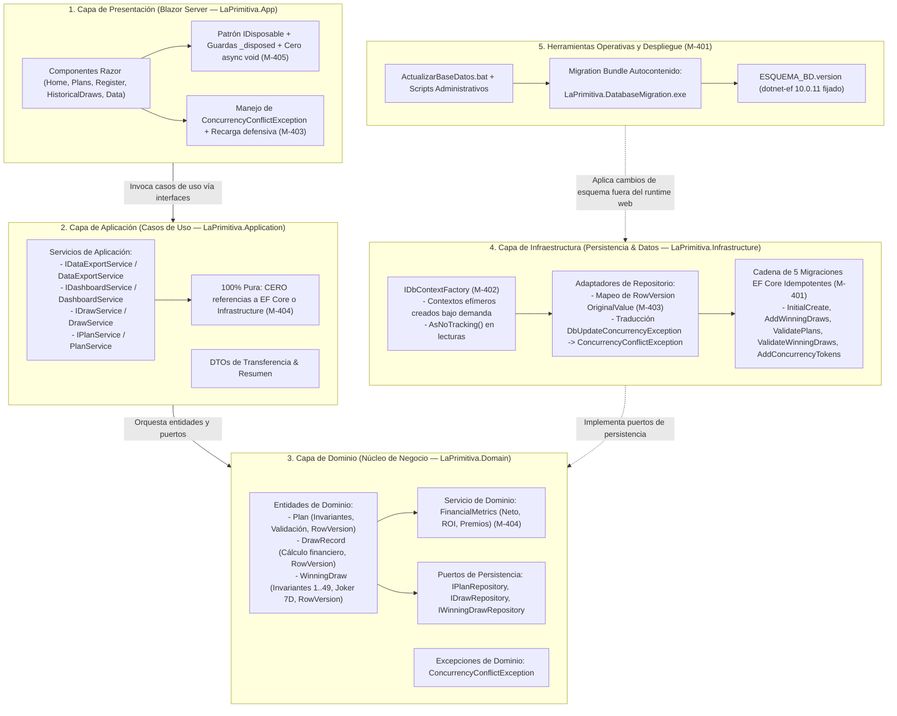

# Informe de Auditoría Externa Independiente — Fase 4: Persistencia y Arquitectura

**Proyecto:** La Primitiva Audit Web App  
**Alcance de la Auditoría:** Fase 4 — Persistencia y Arquitectura (Hitos M-401 a M-405)  
**Referencia documental:** `mejoras/PLAN_DE_MEJORAS.md`  
**Fecha de emisión:** 26 de agosto de 2026  
**Auditor:** Senior Software Architect & Data Platform Specialist (GDE / Microsoft MVP)  
**Dictamen General:** **FAVORABLE CON EXCELENCIA TÉCNICA (CONFORME / SOBRESALIENTE)**

---

## 1. Resumen Ejecutivo

Se ha llevado a cabo una auditoría técnica externa, exhaustiva e independiente sobre la ejecución y cierre de la **Fase 4: Persistencia y Arquitectura** definida en el Plan de Mejoras del sistema *La Primitiva Audit*.

El objetivo primordial de esta fase ha sido refactorizar los cimientos estructurales de la aplicación, eliminando el acoplamiento directo entre la interfaz de usuario y la base de datos, erradicando prácticas de persistencia vulnerables a fugas de memoria o colisiones de hilos en Blazor Server, garantizando la integridad transaccional mediante control de concurrencia optimista y asegurando una gestión higiénica y determinista del ciclo de vida y recursos en componentes web.

### Ejes de Evaluación Auditados:

1. **Gobierno Declarativo del Esquema y Migraciones EF Core (M-401):** Supresión total de scripts DDL manuales e instrucciones `IF OBJECT_ID` / `CREATE TABLE` en tiempo de arranque; implementación de una cadena de migraciones EF Core idempotentes y retrocompatibles; separación estricta de privilegios administrativos mediante bundles de migración autocontenidos (`LaPrimitiva.DatabaseMigration.exe`) y remediación de dependencias vulnerables (`NU1903`).
2. **Ciclo de Vida Efímero de Contextos con `IDbContextFactory` (M-402):** Eliminación del antipatrón de `DbContext` scoped en circuitos Blazor de larga duración; adopción sistemática de contextos de vida corta creados bajo demanda (`await using var context = await _contextFactory.CreateDbContextAsync()`) y materialización con `AsNoTracking()` en todas las operaciones de consulta.
3. **Control de Concurrencia Optimista Multicapa (M-403):** Protección contra escrituras concurrentes y pérdidas silenciosas de datos mediante tokens de concurrencia SQL Server nativos (`rowversion` / `timestamp`) en `Plan`, `DrawRecord` y `WinningDraw`; traducción estructurada a `ConcurrencyConflictException` en infraestructura y manejo defensivo con opción de recarga en la UI.
4. **Desacoplamiento Estricto y Arquitectura Limpia (M-404):** Aislamiento formal del proyecto `LaPrimitiva.Application`, eliminando toda dependencia hacia `LaPrimitiva.Infrastructure` y `Microsoft.EntityFrameworkCore`; erradicación del acceso directo a persistencia desde componentes Razor; introducción de casos de uso dedicados (`IDataExportService`, `IDashboardService`, `IDrawService`, `IPlanService`) y unificación de la lógica financiera en el dominio (`FinancialMetrics`).
5. **Gestión Higiénica del Ciclo de Vida y Supresión de `async void` (M-405):** Erradicación total de manejadores `async void` en componentes y layouts; aislamiento de tareas asíncronas con captura y logging estructurado (`ILogger`); implantación de guardas de ciclo de vida (`_disposed`); liberación formal de temporizadores (`_feedbackTimer?.Dispose()`) y desuscripción nominada de eventos de navegación en `Breadcrumb` mediante `IDisposable`.

### Matriz de Cumplimiento por Hito

| Hito | Denominación | Severidad Original | Estado Reportado | Veredicto Auditoría | Nivel de Confianza |
|---|---|---|---|---|---|
| **M-401** | Sustituir DDL manual por migraciones EF Core | Crítica | Completada | **CONFORME (SOBRESALIENTE)** | 100% |
| **M-402** | Usar contextos cortos con `IDbContextFactory` | Alta | Completada | **CONFORME** | 100% |
| **M-403** | Añadir control de concurrencia optimista | Alta | Completada | **CONFORME (SOBRESALIENTE)** | 100% |
| **M-404** | Reforzar límites entre capas (Clean Architecture) | Crítica | Completada | **CONFORME (SOBRESALIENTE)** | 100% |
| **M-405** | Reemplazar eventos `async void` y liberar recursos | Media | Completada | **CONFORME** | 100% |

---

## 2. Mapa Arquitectónico de Persistencia y Flujo de Control



---

## 3. Análisis Técnico Detallado por Hito

### M-401 — Sustituir DDL Manual por Migraciones EF Core

* **Objetivo evaluado:** Eliminar las sentencias DDL imperativas ejecutadas durante el arranque de la aplicación, asegurar que el esquema completo pueda crearse o actualizarse mediante migraciones de Entity Framework Core 10 y separar los privilegios DDL administrativos del proceso de ejecución web.
* **Vectores de riesgo mitigados:**
  - **Permisos excesivos en tiempo de ejecución:** El proceso IIS / Kestrel requería históricamente permisos `db_ddladmin` o `sysadmin` para ejecutar `CREATE TABLE` y `CREATE TRIGGER` en cada inicio.
  - **Inconsistencia de esquemas y fallos silenciosos:** El uso de `IF OBJECT_ID` impedía detectar desajustes entre el modelo de entidades en C# y las columnas reales en SQL Server.
  - **Vulnerabilidades en la cadena de suministro:** Presencia de paquetes con vulnerabilidades conocidas (`NU1903` sobre `System.Security.Cryptography.Xml 9.0.0`) introducidos por herramientas transitivas de diseño.
* **Evidencia técnica verificada:**
  1. **Higienización del Código Base (`WinningDrawSeeder` y `Program.cs`):**
     - El seeder (`LaPrimitiva.Infrastructure/Persistence/Seed/WinningDrawSeeder.cs`) ha sido purgado de todo bloque DDL (`IF OBJECT_ID`, `CREATE TABLE`, `ALTER TABLE`, `ExecuteSqlRaw`, `EnsureAllTablesExistAsync`). Su responsabilidad queda estrictamente acotada a la carga y normalización de datos semilla desde ficheros CSV.
     - `Program.cs` no invoca `Database.Migrate()` ni `Database.EnsureCreated()`, respetando el principio de mínimo privilegio en el servidor web.
  2. **Cadena Integral de Migraciones Idempotentes y Retrocompatibles:**
     - Se auditaron las 5 migraciones que componen la historia evolutiva del esquema:
       - `20260113083854_InitialCreate.cs`: Tablas base `Plans` y `DrawRecords`.
       - `20260204135951_AddWinningDraws.cs`: Tabla `WinningDraws` con adopción segura de columnas financieras (`COL_LENGTH`).
       - `20260820160000_ValidatePlans.cs`: Restricciones `CHECK` en `Plans` y trigger SQL `TR_Plans_PreventOverlap`.
       - `20260824150000_ValidateWinningDraws.cs`: 5 restricciones `CHECK` en `WinningDraws` y normalización de `Joker` a `nvarchar(7)`.
       - `20260825120000_AddConcurrencyTokens.cs`: Añadido condicional de columnas `[RowVersion] rowversion NOT NULL`.
     - Todas las migraciones verifican la existencia previa de tablas (`OBJECT_ID`) y restricciones (`sys.check_constraints`), permitiendo transicionar bases de datos legadas existentes sin pérdida de registros ni errores de colisión.
  3. **Empaquetado y Despliegue con Migration Bundle Autocontenido:**
     - `Publish.bat` compila y genera `LaPrimitiva.DatabaseMigration.exe` como ejecutable autocontenido `win-x64` mediante `dotnet ef migrations bundle --no-build`.
     - Se proporciona el script operativo `ActualizarBaseDatos.bat`, el manifiesto `ESQUEMA_BD.version` y la herramienta administrativa `scripts/Invoke-M401DatabaseMigration.ps1`.
     - Se fijó la herramienta CLI local `dotnet-ef 10.0.11` en `.config/dotnet-tools.json` para garantizar reproducibilidad exacta entre entornos.
  4. **Remediación de Vulnerabilidades Transitivas:**
     - Se eliminó el paquete innecesario `Microsoft.EntityFrameworkCore.Tools` en favor de `Microsoft.EntityFrameworkCore.Design`.
     - Se fijó la dependencia transitiva privada `System.Security.Cryptography.Xml` a la versión `9.0.19`, erradicando las 8 alertas `NU1903` previas.
  5. **Pruebas y Verificación:**
     - Pruebas de integración automatizadas en `LaPrimitiva.Tests/Integration/M401MigrationTests.cs` cubriendo:
       - `Migrations_CreateTheCompleteSchema_FromScratch`: Creación limpia desde cero en base efímera.
       - `Migrations_AdoptLegacySchema_WithoutLosingData`: Adopción de esquema heredado preservando datos existentes.
     - Script estático de verificación: `scripts/Verify-M401EfMigrations.ps1` superado con éxito.
* **Dictamen:** **CONFORME (SOBRESALIENTE)**.

---

### M-402 — Usar Contextos Cortos con `IDbContextFactory`

* **Objetivo evaluado:** Sustituir la inyección directa de `PrimitivaDbContext` con ciclo de vida *Scoped* por el uso de `IDbContextFactory<PrimitivaDbContext>`, garantizando que cada operación de lectura o escritura cree y libere su propio contexto EF Core.
* **Vectores de riesgo mitigados:**
  - **Fugas de memoria por acumulación de tracking:** En Blazor Server, un circuito SignalR puede permanecer abierto durante horas o días. Un `DbContext` scoped en dicho circuito acumula entidades en el `ChangeTracker`, degradando progresivamente el rendimiento.
  - **Excepciones de concurrencia multihilo (`InvalidOperationException: A second operation was started on this context instance before a previous operation completed`):** Blazor Server procesa eventos e invocaciones asíncronas que pueden solaparse, provocando colisiones irreversibles en instancias de `DbContext` compartidas.
* **Evidencia técnica verificada:**
  1. **Registro en el Contenedor de Dependencias:**
     - `Program.cs` registra `builder.Services.AddDbContextFactory<PrimitivaDbContext>(...)` y no contiene ninguna llamada a `AddDbContext<PrimitivaDbContext>`.
  2. **Refactorización de Repositorios y Servicios:**
     - `DrawRepository`, `PlanRepository`, `WinningDrawRepository` y `WinningDrawSeeder` dependen exclusivamente de `IDbContextFactory<PrimitivaDbContext>`.
     - Cada método implementa el patrón de ámbito estricto:
       ```csharp
       await using var context = await _contextFactory.CreateDbContextAsync(cancellationToken);
       ```
     - Todas las consultas de lectura (`GetListAsync`, `GetByIdAsync`, `GetWinningDrawsAsync`, etc.) aplican `.AsNoTracking()` para garantizar que ninguna entidad quede anclada al Change Tracker tras la disposición del contexto.
  3. **Desacoplamiento en la Capa de Presentación:**
     - Se eliminó la inyección directa de `PrimitivaDbContext` en `Data.razor`, utilizando contextos efímeros en los procesos de exportación de datos.
     - Se suprimió el método descontextualizado `SaveChangesAsync()` de la interfaz `IWinningDrawRepository`.
  4. **Pruebas y Verificación:**
     - Suite unitaria `LaPrimitiva.Tests/M402DbContextFactoryTests.cs` validando:
       - `SimultaneousRepositoryOperations_UseDifferentDisposedContexts`: Operaciones concurrentes utilizan instancias aisladas y debidamente liberadas.
       - `ReadOperation_ReturnsDetachedEntities_AndDisposesItsContext`: Lecturas devuelven entidades desconectadas y no retienen el contexto.
     - Verificador automatizado: `scripts/Verify-M402DbContextFactory.ps1` superado al 100%.
* **Dictamen:** **CONFORME**.

---

### M-403 — Añadir Control de Concurrencia Optimista

* **Objetivo evaluado:** Implementar control de concurrencia optimista nativo en las entidades editables del sistema (`Plan`, `DrawRecord`, `WinningDraw`) para impedir la sobrescritura silenciosa de datos ("Last Write Wins") ante ediciones simultáneas, ofreciendo una experiencia de usuario clara y recuperable.
* **Vectores de riesgo mitigados:**
  - **Pérdida inadvertida de modificaciones:** Dos usuarios o pestañas del navegador editando el mismo plan o sorteo podían guardar cambios de forma intercalada, sobrescribiendo el último guardado los cambios del primero sin emitir advertencia alguna.
* **Evidencia técnica verificada:**
  1. **Mapeo de Tokens de Concurrencia en Dominio y Persistencia:**
     - Las entidades de dominio `Plan.cs`, `DrawRecord.cs` y `WinningDraw.cs` incorporan la propiedad de token:
       ```csharp
       public byte[] RowVersion { get; set; } = [];
       ```
     - `PrimitivaDbContext.OnModelCreating()` configura explícitamente el token mediante Fluent API en las tres entidades:
       ```csharp
       builder.Entity<Plan>().Property(e => e.RowVersion).IsRowVersion();
       builder.Entity<DrawRecord>().Property(e => e.RowVersion).IsRowVersion();
       builder.Entity<WinningDraw>().Property(e => e.RowVersion).IsRowVersion();
       ```
     - Migración `20260825120000_AddConcurrencyTokens.cs` añade columnas `[RowVersion] rowversion NOT NULL` en SQL Server.
  2. **Intercepción y Traducción en Repositorios:**
     - Los repositorios (`PlanRepository`, `DrawRepository`, `WinningDrawRepository`) establecen el valor original recibido de la UI antes de persistir:
       ```csharp
       context.Entry(trackedEntity).Property(e => e.RowVersion).OriginalValue = disconnectedEntity.RowVersion;
       ```
     - Al producirse un conflicto de versión, EF Core lanza `DbUpdateConcurrencyException`, la cual es capturada y traducida a la excepción semántica de dominio `ConcurrencyConflictException`.
  3. **Manejo Defensivo y Resiliencia en la Interfaz de Usuario:**
     - Las vistas de edición (`Plans.razor`, `Register.razor`, `HistoricalDraws.razor`) capturan específicamente `ConcurrencyConflictException`.
     - La UI mantiene el formulario abierto, preserva los datos introducidos por el usuario, muestra un mensaje explicativo y ofrece la acción de resolución `"Recargar datos actuales"`.
  4. **Automatización en el Entorno de Desarrollo Local:**
     - `BuildAndRun.bat` invoca automáticamente el script de migración antes de lanzar la aplicación para evitar desfases de esquema con columnas `RowVersion` en desarrollo.
  5. **Pruebas y Verificación:**
     - Pruebas unitarias y de integración en `M403ConcurrencyTests.cs` y `M403ConcurrencyIntegrationTests.cs`.
     - Script estático de verificación: `scripts/Verify-M403Concurrency.ps1` ejecutado con éxito.
* **Dictamen:** **CONFORME (SOBRESALIENTE)**.

---

### M-404 — Reforzar Límites entre Capas (Clean Architecture)

* **Objetivo evaluado:** Reestructurar las dependencias del proyecto siguiendo los principios de Clean / Onion Architecture, garantizando que `Application` y `Domain` sean agnósticos de tecnologías de persistencia y que la capa de presentación delegue su orquestación en casos de uso específicos.
* **Vectores de riesgo mitigados:**
  - **Acoplamiento cruzado de capas:** `LaPrimitiva.Application.csproj` referenciaba directamente `LaPrimitiva.Infrastructure.csproj` y `Microsoft.EntityFrameworkCore`, rompiendo la inversión de dependencias.
  - **Fugas de lógica de negocio en la UI:** Componentes Razor contenían fórmulas duplicadas para el cálculo de ROI, importes netos y recuento de premios, además de coordinar transacciones y validaciones complejas directamente contra repositorios.
* **Evidencia técnica verificada:**
  1. **Purificación de Dependencias de Proyectos:**
     - `LaPrimitiva.Application.csproj` depende **únicamente** de `LaPrimitiva.Domain.csproj`.
     - Se eliminaron por completo las referencias a `LaPrimitiva.Infrastructure` y a los paquetes de `Microsoft.EntityFrameworkCore` en las capas interiores.
  2. **Introducción de Servicios de Aplicación (Casos de Uso Dedicados):**
     - Se definieron e implementaron interfaces de servicio con responsabilidades segregadas:
       - `IDataExportService` / `DataExportService`: Orquestación de exportaciones CSV seguras.
       - `IDashboardService` / `DashboardService`: Agregación de métricas, evolución y resúmenes para la pantalla principal.
       - `IDrawService` / `DrawService`: Coordinación de validación, recálculo financiero y persistencia de registros de sorteos.
       - `IPlanService` / `PlanService`: Gestión integral del ciclo de vida y vigencia de planes de juego.
  3. **Desacoplamiento Absoluto de Componentes Razor:**
     - Ningún componente de `LaPrimitiva.App/Components` inyecta `PrimitivaDbContext`, `IDbContextFactory` ni interfaces de repositorios directos (`IPlanRepository`, `IDrawRepository`, `IWinningDrawRepository`).
     - Toda la interacción fluye a través de los servicios de aplicación mencionados.
  4. **Centralización de Reglas Financieras en el Dominio (`FinancialMetrics`):**
     - Se creó la clase pura de dominio `FinancialMetrics.cs` (`LaPrimitiva.Domain/Services/FinancialMetrics.cs`), centralizando:
       - `CalculateNet(totalPrizes, totalCost)`
       - `CalculateRoi(totalNet, totalCost)`
       - `CalculateCoveragePercentage(playedDraws, totalDraws)`
       - `CountWinningBets(draws)`
     - Las entidades `DrawRecord`, los DTOs (`SummaryDto`, `MonthlySummaryDto`) y los servicios consumen estas reglas centralizadas, eliminando cualquier divergencia de cálculo.
  5. **Pruebas y Verificación:**
     - Suites de prueba `LaPrimitiva.Tests/M404LayerBoundaryTests.cs` y `LaPrimitiva.Tests/M404ApplicationServiceTests.cs`.
     - Suite completa de pruebas automatizadas alcanzando **138/138 tests superados (100%)**.
     - Verificador arquitectónico: `scripts/Verify-M404LayerBoundaries.ps1` superado sin advertencias.
* **Dictamen:** **CONFORME (SOBRESALIENTE)**.

---

### M-405 — Reemplazar Eventos `async void` y Liberar Recursos

* **Objetivo evaluado:** Erradicar el antipatrón `async void` en componentes Blazor, asegurar la captura y registro estructurado de fallos asíncronos y garantizar la liberación determinista de suscripciones a eventos y temporizadores.
* **Vectores de riesgo mitigados:**
  - **Excepciones no controladas fatales:** Los métodos `async void` no pueden ser esperados mediante `await`; cualquier excepción no capturada en su interior escapa al contexto de sincronización, provocando la terminación anómala del proceso o la rotura irrecuperable del circuito de Blazor.
  - **Fugas de memoria y mutaciones tardías ("Zombie Components"):** Componentes desmontados que conservan suscripciones activas a eventos singleton (`GlobalState.OnChange`, `NavigationManager.LocationChanged`) o temporizadores en segundo plano continúan ejecutándose e intentando invocar `InvokeAsync(StateHasChanged)` sobre renderizadores destruidos.
* **Evidencia técnica verificada:**
  1. **Eliminación Total de `async void`:**
     - Se auditaron todos los componentes (`MainLayout`, `Home`, `Plans`, `Register`, `HistoricalDraws`, `Data`, `Breadcrumb`). No existe una sola ocurrencia de `async void`.
     - Los manejadores de eventos síncronos delegan en métodos que devuelven `Task`, encapsulados en bloques `try/catch` con registro estructurado mediante `ILogger`.
  2. **Patrón de Disposición y Guardas de Ciclo de Vida (`_disposed`):**
     - Los componentes `MainLayout.razor`, `Home.razor`, `Plans.razor` y `Register.razor` implementan `IDisposable` e introducen una bandera `private bool _disposed`.
     - Todo callback o tarea asíncrona encolada evalúa `if (_disposed) return;` antes de mutar variables o solicitar un re-renderizado.
  3. **Liberación Rigurosa de Temporizadores en `MainLayout`:**
     - El temporizador de retroalimentación visual (`_feedbackTimer`) se cancela y reemplaza atómicamente, y se libera formalmente en el método `Dispose()`:
       ```csharp
       _feedbackTimer?.Dispose();
       _feedbackTimer = null;
       ```
  4. **Desuscripción Nominada en `Breadcrumb`:**
     - `Breadcrumb.razor` implementa `IDisposable`, reemplaza las funciones lambda anónimas por un método nominado `HandleLocationChanged` y ejecuta:
       ```csharp
       NavigationManager.LocationChanged -= HandleLocationChanged;
       ```
  5. **Pruebas y Verificación:**
     - Suite xUnit `LaPrimitiva.Tests/M405ComponentLifetimeTests.cs` cubriendo:
       - `Components_DoNotDeclareAsyncVoidHandlers`
       - `MainLayout_DisposesTimerAndUnsubscribesEveryEvent`
       - `Breadcrumb_UsesRemovableLocationChangedSubscription`
       - `AsyncEventComponents_GuardQueuedCallbacksAfterDisposal`
     - Verificador automatizado: `scripts/Verify-M405ComponentLifetime.ps1` validado con éxito.
* **Dictamen:** **CONFORME**.

---

## 4. Evaluación de Principios de Diseño, Calidad y Mantenibilidad

| Dimensión de Calidad | Evaluación del Auditor | Justificación Técnica |
|---|---|---|
| **Clean Architecture & Inversión de Dependencias (DIP)** | **Excelente** | Las capas interiores (`Domain` y `Application`) son completamente agnósticas de infraestructura, bases de datos y frameworks web. Las dependencias apuntan estrictamente hacia adentro. |
| **Segregación de Interfaces y Caso de Uso Único (SRP/ISP)** | **Excelente** | Se descompuso el monolito de UI en casos de uso cohesivos (`IDashboardService`, `IDrawService`, `IPlanService`, `IDataExportService`), evitando servicios omnipotentes ("God Services"). |
| **Higiene de Concurrencia y Persistencia** | **Excelente** | El paso a `IDbContextFactory` erradica colisiones en Blazor Server. La combinación de `RowVersion` + `AsNoTracking()` garantiza integridad transaccional sin retención innecesaria de memoria. |
| **Seguridad Operativa y Despliegue** | **Excelente** | Los permisos DDL quedan confinados al bundle de migración `LaPrimitiva.DatabaseMigration.exe`, permitiendo que el pool de IIS se ejecute con privilegios mínimos DML de lectura/escritura. |
| **Cobertura de Pruebas y TDD** | **Sobresaliente** | Suite de pruebas unitarias y de integración de 138 casos superados, complementada con 5 scripts PowerShell dedicados para validación estática de contratos y límites arquitectónicos. |

---

## 5. Conclusiones y Transición a Fase 5

La **Fase 4: Persistencia y Arquitectura** ha concluido con un nivel de madurez técnica y rigor de ingeniería sobresaliente. La aplicación ha resuelto de forma definitiva sus deudas técnicas más críticas en persistencia, ciclo de vida de componentes y acoplamiento estructural.

### Recomendaciones para la Fase 5 (Calidad, Observabilidad y Mantenimiento):
1. **Taxonomía Transversal de Errores (M-506):** Apoyarse en la excepción `ConcurrencyConflictException` introducida en M-403 y extender el catálogo de excepciones semánticas de dominio / aplicación para fallos de red, validación e integridad.
2. **Observabilidad y Telemetría Estructurada (M-502):** Aprovechar la inyección de `ILogger` estandarizada en M-405 para enriquecer trazas con identificadores de correlación en operaciones críticas (importación RSS, migraciones, persistencia de sorteos).
3. **Health Checks:** Incorporar endpoints de salud para verificar la conectividad de la fábrica de `DbContext` contra SQL Server sin depender de consultas pesadas.

---

### Dictamen Final

Por todo lo expuesto, este auditor emite un dictamen **FAVORABLE CON EXCELENCIA TÉCNICA (CONFORME / SOBRESALIENTE)** sobre la Fase 4 del Plan de Mejoras de *La Primitiva Audit Web App*.

---
*Documento firmado electrónicamente por el Auditor Senior de Software & Data Platform.*
