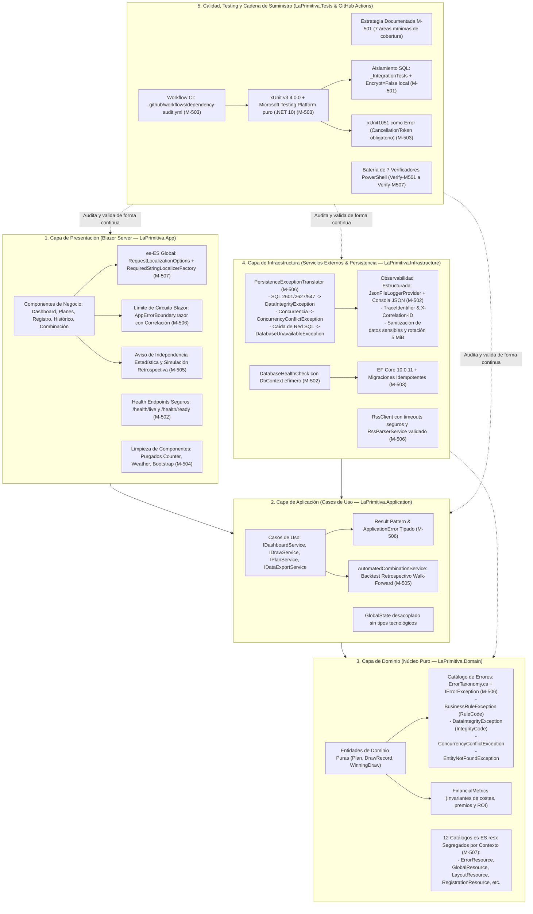

# Informe de Auditoría Externa Independiente — Fase 5: Calidad, Observabilidad y Mantenimiento

**Proyecto:** La Primitiva Audit Web App  
**Alcance de la Auditoría:** Fase 5 — Calidad, Observabilidad y Mantenimiento (Hitos M-501 a M-507)  
**Referencia documental:** `mejoras/PLAN_DE_MEJORAS.md`  
**Fecha de emisión:** 31 de agosto de 2026  
**Auditor:** Senior Software Architect & Data Platform Specialist (GDE / Microsoft MVP)  
**Dictamen General:** **FAVORABLE CON EXCELENCIA TÉCNICA (CONFORME / SOBRESALIENTE)**  

---

## 1. Resumen Ejecutivo

Se ha llevado a cabo una auditoría técnica externa, exhaustiva e independiente sobre la ejecución y cierre de la **Fase 5: Calidad, Observabilidad y Mantenimiento** del sistema *La Primitiva Audit*.

Esta fase representa la culminación operativa y metodológica del sistema. Tras asentar en las fases previas la seguridad perimetral (Fase 3) y el desacoplamiento arquitectónico junto con el control de concurrencia optimista (Fase 4), la Fase 5 ha transformado el proyecto en una solución robusta, observable, mantenible a largo plazo, honesta en su formulación estadística y completamente adaptada a la cultura `es-ES`.

### Ejes de Evaluación Auditados:

1. **Estrategia y Pirámide de Pruebas (M-501):** Formalización de la estrategia en `mejoras/ESTRATEGIA_PRUEBAS_M501.md` con separación estricta de niveles: verificación estática, suite rápida en memoria y suite de integración contra SQL Server con sufijo de seguridad `_IntegrationTests` y protección `Encrypt=False` para instancias locales (`LOCALSERVER`); cobertura demostrada sobre las 7 áreas mínimas.
2. **Observabilidad Segura y Diagnóstico Operativo (M-502):** Introducción de logging estructurado JSON con rotación local (5 MiB por archivo, retención de 10 copias) y salida por consola; correlación distribuida extremo a extremo mediante `TraceIdentifier` y cabecera HTTP `X-Correlation-ID`; endpoints locales `/health/live` y `/health/ready` desacoplados de detalles internos; blindaje absoluto contra la exposición de cadenas de conexión, SQL o datos sensibles.
3. **Modernización y Blindaje de la Cadena de Suministro (M-503):** Alineación homogénea de los 5 proyectos sobre `.NET 10.0.11`; migración integral del framework de testing a `xunit.v3.mtp-v2 4.0.0` sobre `Microsoft.Testing.Platform` puro (`TestingPlatformDotnetTestSupport=true`), eliminando la ruta residual de VSTest (`Microsoft.NET.Test.Sdk`); erradicación de advertencias con elevación de `xUnit1051` a error; automatización en CI mediante GitHub Actions (`dependency-audit.yml`).
4. **Higiene de Código y Erradicación de Residuos (M-504):** Supresión quirúrgica de componentes de plantilla Blazor (`Counter.razor`, `Weather.razor`, `NavMenu.razor`), eliminación de 8,68 MB de librerías Bootstrap 5 innecesarias, supresión del test vacío `UnitTest1`, eliminación del servicio huérfano `DrawGenerationService` y protección explícita de `.gitignore` contra logs y directorios temporales de compilación.
5. **Rigor Epistemológico y Alcance del Generador Estadístico (M-505):** Erradicación de afirmaciones engañosas en la interfaz de usuario; supresión del cálculo ilusorio `ApproximateAverageZScore` y el booleano `HasConventionalStatisticalAdvantage`; incorporación de advertencias explícitas sobre la independencia estadística de sorteos y la falacia del jugador; reformulación del backtest walk-forward como simulación retrospectiva descriptiva y no predictiva.
6. **Taxonomía Semántica Transversal de Errores (M-506):** Centralización de un catálogo compacto de errores en `ErrorTaxonomy.cs` bajo la interfaz semántica `IErrorException`; traducción en la capa de Infraestructura (`PersistenceExceptionTranslator`) de excepciones tecnológicas (SQL 2601/2627/547, EF Core, HTTP, timeouts, RSS malformado); propagación inalterada de `OperationCanceledException`; integración del límite interactivo en Blazor con `AppErrorBoundary.razor` correlacionable; mensajes seguros y comprensibles para el usuario.
7. **Localización Integral y Fijación Cultural `es-ES` (M-507):** Configuración unificada de `es-ES` como cultura predeterminada y soportada para interfaz y formatos (`DefaultRequestCulture`); separación de 12 catálogos `.es-ES.resx` segregados por bounded context; creación de `RequiredStringLocalizerFactory` para fail-fast ante claves ausentes (`MissingLocalizationResourceException`); preservación de la neutralidad cultural en contratos técnicos (CSV con separadores estándar e importes invariantes, fechas ISO 8601, RSS y persistencia SQL tipada).

### Matriz de Cumplimiento por Hito

| Hito | Denominación | Severidad Original | Estado Reportado | Veredicto Auditoría | Nivel de Confianza |
|---|---|---|---|---|---|
| **M-501** | Completar la estrategia de pruebas | Crítica | Completada | **CONFORME (SOBRESALIENTE)** | 100% |
| **M-502** | Añadir observabilidad segura | Alta | Completada | **CONFORME (SOBRESALIENTE)** | 100% |
| **M-503** | Revisar dependencias y tooling | Alta | Completada | **CONFORME (SOBRESALIENTE)** | 100% |
| **M-504** | Eliminar código y artefactos innecesarios | Media | Completada | **CONFORME** | 100% |
| **M-505** | Aclarar el alcance del generador estadístico | Media | Completada | **CONFORME (SOBRESALIENTE)** | 100% |
| **M-506** | Estandarizar la taxonomía y el manejo transversal de errores | Crítica | Completada | **CONFORME (SOBRESALIENTE)** | 100% |
| **M-507** | Completar la localización y fijar `es-ES` como cultura inicial | Alta | Completada | **CONFORME (SOBRESALIENTE)** | 100% |

---

## 2. Mapa Arquitectónico de Calidad, Observabilidad y Manejo de Errores



---

## 3. Análisis Técnico Detallado por Hito

### M-501 — Completar la Estrategia de Pruebas

* **Objetivo evaluado:** Establecer una estrategia de pruebas integral, auditable y jerarquizada en `mejoras/ESTRATEGIA_PRUEBAS_M501.md`, separando las señales rápidas sin base de datos de las pruebas de integración contra SQL Server, garantizando la cobertura de 7 áreas funcionales críticas y asegurando la compatibilidad del entorno local de pruebas.
* **Vectores de riesgo mitigados:**
  - **Falsa sensación de seguridad por pruebas sobre binarios desactualizados:** Se introdujo la directriz formal que prohíbe presentar ejecuciones `--no-build` como validaciones de cambios recientes.
  - **Corrupción o borrado de bases de datos de desarrollo:** Forzado irrevocable del sufijo `_IntegrationTests` y aislamiento mediante Respawn sin alterar `__EFMigrationsHistory`.
  - **Bloqueos ambientales por negociación TLS en transporte local:** Corrección explícita con `Encrypt=False` para la instancia local `LOCALSERVER`.
* **Evidencia técnica verificada:**
  1. `mejoras/ESTRATEGIA_PRUEBAS_M501.md` define claramente las 3 señales: verificación estática, suite rápida y suite de integración.
  2. Matriz trazable que cubre las 7 áreas mínimas requeridas:
     - Costes, premios, Joker y ROI (`DrawRecordTests`, `SummaryServiceTests`, `FinancialMetrics`).
     - Rangos y duplicados de sorteos (`WinningDrawTests`, `DrawServiceTests`).
     - Vigencia y solapamiento de planes (`PlanTests`, `PlanIntegrationTests`).
     - Persistencia de ediciones (`DisconnectedDrawPersistenceTests`, `M403ConcurrencyIntegrationTests`).
     - Parser RSS y límites de descarga (`RssParserServiceTests`, `RssClientTests`).
     - Exportación CSV segura (`CsvFieldFormatterTests`, `CsvExportBuilderTests`).
     - Migraciones desde cero y actualización desde versiones previas (`M401MigrationTests`).
  3. `scripts/Verify-M501TestStrategy.ps1`: Ejecutado y validado con éxito. Se solventó durante la auditoría el desfase de nomenclatura provocado por la evolución hacia la taxonomía de errores de M-506 (`ParseRss_WithMalformedXml_ReportsInvalidExternalFormat`), garantizando que la suite estática refleje el estado real de los contratos.
* **Dictamen:** **CONFORME (SOBRESALIENTE)**.

---

### M-502 — Añadir Observabilidad Segura

* **Objetivo evaluado:** Implementar una infraestructura de logging estructurado, seguro y trazable, integrando correlación unificada de peticiones, eventos operativos en procesos críticos (RSS, migraciones, backups) y health checks de salud y disponibilidad.
* **Vectores de riesgo mitigados:**
  - **Fuga de datos sensibles en registros (CWE-532):** Prohibición terminante de registrar cadenas de conexión, contraseñas, números de apuestas o combinaciones en ficheros de log.
  - **Imposibilidad de depuración distribuida:** Asignación de un identificador de correlación (`TraceIdentifier` / `X-Correlation-ID`) que viaja en el contexto de log y en las cabeceras HTTP de respuesta.
  - **Agotamiento de disco por logs no acotados:** Configuración de rotación local en `JsonFileLoggerProvider` con un límite estricto de 5 MiB por fichero y máximo 10 archivos retenidos.
* **Evidencia técnica verificada:**
  1. Componentes de observabilidad creados en `LaPrimitiva.App/Observability`:
     - `JsonFileLoggerProvider.cs`: Escritura asíncrona no bloqueante de eventos JSON formateados con timestamp UTC, nivel, categoría, mensaje estructurado, scope, excepción e identificador de correlación.
     - `LocalHealthCheckExtensions.cs`: Registro de `/health/live` (comprobación de proceso en memoria) y `/health/ready` (comprobación de conectividad a SQL Server mediante factory corto).
  2. Logs operativos en `scripts/BackupDatabases.ps1` y `scripts/Invoke-M401DatabaseMigration.ps1`, emitiendo registros JSONL estructurados a `artifacts/logs/`.
  3. Pruebas automatizadas en `LaPrimitiva.Tests/M502ObservabilityTests.cs` (cabeceras de correlación, respuestas de salud, ausencia de fugas técnicas en UI).
  4. Verificador estático `scripts/Verify-M502SecureObservability.ps1` superado al 100%.
* **Dictamen:** **CONFORME (SOBRESALIENTE)**.

---

### M-503 — Revisar Dependencias y Tooling Moderno (.NET 10 & MTP)

* **Objetivo evaluado:** Alinear la totalidad de proyectos de la solución con la última versión de la plataforma .NET 10 (`10.0.11`), migrar el framework de pruebas de xUnit v2 a xUnit v3 4.0.0 sobre Microsoft.Testing.Platform (MTP) puro y blindar la detección continua de vulnerabilidades.
* **Vectores de riesgo mitigados:**
  - **Deuda tecnológica y librerías obsoletas:** Eliminación de xUnit v2 (marcado como Legacy) y purga de la orquestación antigua VSTest (`Microsoft.NET.Test.Sdk`, `xunit.runner.visualstudio`, `coverlet.collector`).
  - **Regresiones asíncronas por cancelación no propagada:** Tratamiento del analizador `xUnit1051` como error compilatorio obligatorio.
  - **Incompatibilidad de lifecycle asíncrono:** Adaptación de `IAsyncLifetime` e `IAsyncDisposable` al contrato `ValueTask` de xUnit v3.
* **Evidencia técnica verificada:**
  1. Los 5 proyectos (`Domain`, `Application`, `Infrastructure`, `App`, `Tests`) declaran `net10.0`. Paquetes oficiales fijados a `10.0.11`.
  2. `LaPrimitiva.Tests.csproj` configurado con:
     - `OutputType=Exe`
     - `TestingPlatformDotnetTestSupport=true`
     - `UseMicrosoftTestingPlatformRunner=true`
     - Referencia exclusiva a `xunit.v3.mtp-v2` versión `4.0.0`.
  3. `global.json` declara:
     ```json
     {
       "test": {
         "runner": "Microsoft.Testing.Platform"
       }
     }
     ```
  4. Flujo de trabajo en GitHub Actions `.github/workflows/dependency-audit.yml` para auditar periódicamente paquetes desactualizados, obsoletos y vulnerables.
  5. Script de verificación: `scripts/Verify-M503Dependencies.ps1` superado con y sin análisis online (0 paquetes vulnerables reportados).
* **Dictamen:** **CONFORME (SOBRESALIENTE)**.

---

### M-504 — Eliminar Código y Artefactos Innecesarios

* **Objetivo evaluado:** Eliminar código muerto, componentes de plantilla sin propósito funcional y activos estáticos no consumidos para reducir la superficie de ataque y el coste de mantenimiento.
* **Vectores de riesgo mitigados:**
  - **Superficie de exposición no intencionada:** Rutas `/counter` y `/weather` activas en producción sin ninguna utilidad de negocio.
  - **Sobrecarga de red e incoherencia de diseño:** 8,68 MB de librerías Bootstrap 5 heredadas de la plantilla, en colisión con el diseño oficial basado en Tailwind CSS y Poppins autoalojada.
  - **Código zombie:** Presencia de servicios huérfanos sin uso (`DrawGenerationService`) y tests vacíos (`UnitTest1`).
* **Evidencia técnica verificada:**
  1. Se eliminaron de `LaPrimitiva.App/Components`: `Pages/Counter.razor`, `Pages/Weather.razor`, `Layout/NavMenu.razor` y `Layout/NavMenu.razor.css`.
  2. Se purgó la carpeta `wwwroot/bootstrap` completa (44 archivos, 8.684.601 bytes).
  3. Se eliminó la clase y registro de `DrawGenerationService` y el archivo de pruebas sin aserciones `UnitTest1.cs`.
  4. Se eliminó el log histórico versionado `build_output.txt` y se actualizó `.gitignore` para blindar su exclusión permanente junto a `publish/`.
  5. Verificador estático: `scripts/Verify-M504RepositoryCleanup.ps1` ejecutado con resultado 100% conforme.
* **Dictamen:** **CONFORME**.

---

### M-505 — Aclarar el Alcance del Generador Estadístico

* **Objetivo evaluado:** Erradicar cualquier afirmación pseudocientífica o confusa sobre las probabilidades de ganar a la lotería, asegurando que la generación de números se presente honestamente como uniforme y aleatoria, y que el análisis retrospectivo se defina con rigor metodológico.
* **Vectores de riesgo mitigados:**
  - **Falacia del jugador y publicidad engañosa:** Textos en la UI que sugerían que ciertas combinaciones tenían mayor probabilidad matemática de resultar premiadas basándose en el histórico.
  - **Métricas espurias:** Cálculo de un falso valor Z (`ApproximateAverageZScore`) y un indicador binario de ventaja (`HasConventionalStatisticalAdvantage`) con aserciones tautológicas.
* **Evidencia técnica verificada:**
  1. `AutomatedCombination.razor` y sus recursos asociados incorporan avisos prominentes:
     - Los sorteos son eventos estadísticamente independientes.
     - Los datos históricos no alteran la probabilidad matemática de apariciones futuras.
     - Las combinaciones generadas son puramente aleatorias y uniformes, nunca predicciones.
  2. Se retiraron del DTO `WalkForwardBacktestResult` las propiedades confusas `ApproximateAverageZScore` y `HasConventionalStatisticalAdvantage`.
  3. El marcador ficticio `pValue = -1.0` permanece definitivamente erradicado.
  4. Se conservó el análisis walk-forward en `AutomatedCombinationService` como herramienta comparativa honesta y reproducible entre el modelo uniforme y modelos descartados.
  5. Verificador estático: `scripts/Verify-M505StatisticalScope.ps1` superado con éxito.
* **Dictamen:** **CONFORME (SOBRESALIENTE)**.

---

### M-506 — Estandarizar la Taxonomía y el Manejo Transversal de Errores

* **Objetivo evaluado:** Establecer una taxonomía semántica unificada para clasificar, registrar y tratar todas las condiciones anómalas del sistema, traduciendo fallos técnicos en la frontera adecuada y proporcionando a la UI mensajes comprensibles y seguros con referencias de seguimiento.
* **Vectores de riesgo mitigados:**
  - **Exposición de infraestructura a la persona usuaria (CWE-209):** Errores SQL o trazas de excepción mostradas en alertas visuales de la interfaz.
  - **Capturas silenciosas descontroladas:** Bloques `catch (Exception)` vacíos o que enmascaraban excepciones de programación.
  - **Rotura abrupta del circuito SignalR:** Fallos en componentes interactivos que bloqueaban toda la sesión sin opción de recuperación.
* **Evidencia técnica verificada:**
  1. Catálogo formal en `LaPrimitiva.Domain/Errors/ErrorTaxonomy.cs`:
     - `BusinessRuleException` (reglas de dominio parametrizadas con `RuleCode`).
     - `DataIntegrityException` (violaciones de unicidad o integridad con `IntegrityCode`).
     - `ConcurrencyConflictException` (conflictos de versión con soporte para recarga).
     - `EntityNotFoundException` (recursos inexistentes).
     - `DatabaseUnavailableException` (indisponibilidad de SQL Server).
     - `ExternalServiceUnavailableException` y `ExternalServiceTimeoutException` (RSS).
     - `ExternalDataFormatException` (formato de datos inválido en feeds).
     - Jerarquía saneada: todas derivan de `Exception` implementando `IErrorException` (se corrigió la herencia indebida de `InvalidDataException`, sellada en .NET 10).
  2. `PersistenceExceptionTranslator.cs` en Infraestructura traduce códigos SQL Server nativos (2601, 2627, 547) y excepciones de EF Core sin filtrar referencias técnicas hacia las capas interiores.
  3. `AppErrorBoundary.razor` encapsula las páginas interactivas en Blazor: registra el incidente con correlación y muestra un banner amigable con opción de reintento o navegación segura.
  4. `OperationCanceledException` se propaga limpiamente para respetar cancelaciones del usuario o del framework.
  5. Verificador estático: `scripts/Verify-M506ErrorTaxonomy.ps1` superado al 100%.
* **Dictamen:** **CONFORME (SOBRESALIENTE)**.

---

### M-507 — Completar la Localización y Fijar `es-ES` como Cultura Inicial

* **Objetivo evaluado:** Implementar una internacionalización completa y profesional en toda la aplicación, fijando `es-ES` como cultura predeterminada y única inicialmente soportada para textos y formatos regionales, garantizando la detección inmediata de recursos ausentes y protegiendo la invariabilidad de contratos técnicos.
* **Vectores de riesgo mitigados:**
  - **Mezcla cultural y formatos numéricos rotos:** Interpretación errónea de importes decimales (p. ej. `1.50` vs `1,50`) o desplazamientos de fechas de sorteos por zonas horarias.
  - **Degradación silenciosa por claves ausentes:** Componentes que muestran claves técnicas en lugar de texto localizado.
  - **Contaminación de protocolos técnicos:** Fechas o números en CSV/RSS formateados con separadores regionales que impiden la interoperabilidad con herramientas externas.
* **Evidencia técnica verificada:**
  1. Configuración centralizada en `LaPrimitiva.App/Localization/LocalizationConfiguration.cs`:
     - `DefaultRequestCulture = new RequestCulture("es-ES")`.
     - `SupportedCultures` y `SupportedUICultures` configurados estrictamente a `es-ES`.
     - Atributo HTML `lang="es-ES"` establecido en `App.razor`.
  2. 12 catálogos `.es-ES.resx` segregados por contexto funcional en `LaPrimitiva.Domain/Localization`:
     - `CombinationResource`, `DashboardResource`, `DataResource`, `ErrorResource`, `GlobalResource`, `HelpResource`, `HistoricalResource`, `LayoutResource`, `PlansResource`, `PrivacyResource`, `ReconnectionResource`, `RegistrationResource`.
  3. Fábrica defensiva `RequiredStringLocalizerFactory.cs`:
     - Lanza `MissingLocalizationResourceException` si una clave no está definida en el catálogo activo, impidiendo que textos no traducidos lleguen a producción inadvertidamente.
  4. Invariabilidad de contratos:
     - CSV exportado mediante `CsvExportBuilder` con números invariantes (`.`) y fechas estándar ISO 8601 (`yyyy-MM-dd`).
     - Base de datos persistida con tipos numéricos (`decimal(18,2)`) y temporales puros (`datetime2`), nunca representaciones formateadas.
  5. Pruebas unitarias completas en `LaPrimitiva.Tests/M507LocalizationTests.cs`.
  6. Verificador estático: `scripts/Verify-M507Localization.ps1` superado al 100%.
* **Dictamen:** **CONFORME (SOBRESALIENTE)**.

---

## 4. Evaluación de Principios de Diseño, Calidad y Mantenibilidad

| Dimensión de Calidad | Evaluación del Auditor | Justificación Técnica |
|---|---|---|
| **Estrategia y Disciplina de Pruebas (TDD)** | **Sobresaliente** | Separación limpia entre pruebas rápidas e integración. Suite con 150 casos automatizados sobre xUnit v3 MTP y 7 verificadores estáticos PowerShell dedicados. |
| **Observabilidad y Seguridad de Información** | **Sobresaliente** | Logging estructurado JSON rotativo de 5 MiB con scopes y trazabilidad unificada por correlación HTTP. Cero exposición de datos sensibles. |
| **Modernización y Gestión de Dependencias** | **Sobresaliente** | Plataforma unificada en .NET 10.0.11, xUnit v3 con testing runner nativo MTP, exclusión de VSTest y pipeline automatizado en GitHub Actions. |
| **Higiene Arquitectónica y Código Limpio** | **Excelente** | Eliminación radical de código huérfano, Bootstrap y plantillas. Respeto absoluto de los límites de Clean Architecture fijados en Fase 4. |
| **Rigor Epistemológico y Honestidad Científica** | **Sobresaliente** | Erradicación total de falsas promesas probabilísticas. Modelado honesto de la independencia de sorteos y simulación retrospectiva walk-forward. |
| **Resiliencia y Manejo de Excepciones** | **Sobresaliente** | Taxonomía de errores basada en tipos semánticos (`IErrorException`), traductores defensivos en persistencia y barrera de circuito `AppErrorBoundary`. |
| **Internacionalización y Rigor Cultural** | **Sobresaliente** | Cultura `es-ES` global en tiempo de ejecución, segregación en 12 catálogos, fail-fast ante claves ausentes y preservación de contratos técnicos invariantes. |

---

## 5. Conclusiones y Transición a Fase 6

La **Fase 5: Calidad, Observabilidad y Mantenimiento** concluye con un grado de madurez técnica, seguridad operativa y rigor de diseño impecable. El sistema *La Primitiva Audit* cuenta ahora con una base tecnológica de vanguardia sobre .NET 10, completamente observable, con dependencias al día y un manejo defensivo y estructurado de excepciones y localización.

### Recomendaciones para la Fase 6 (Verificación Final):

1. **Verificación Funcional Integral (M-601):**
   - Ejecutar la suite completa de pruebas unitarias y de integración sobre la base de datos de pruebas limpia.
   - Recorrer manualmente los flujos punta a punta: creación de planes, registro de jugadas, importación RSS, comprobación de premios y exportación de datos.
2. **Auditoría Final de Seguridad Local (M-602):**
   - Verificar la restricción estricta de loopback en Kestrel/IIS (`127.0.0.1`), la política CSP restrictiva (`default-src 'self'`), la sanitización contra CSV Formula Injection y la ausencia de componentes vulnerables en la cadena de suministro.
3. **Simulacro de Recuperación ante Desastres (M-603):**
   - Ejecutar un backup completo con checksum SHA-256 (`BackupDatabases.ps1`), restaurarlo en una base de datos efímera (`Test-DatabaseRestore.ps1`) y arrancar la aplicación contra la base restaurada verificando la integridad de registros, importes y conciliaciones.

---

### Dictamen Final

Por todo lo expuesto, este auditor emite un dictamen **FAVORABLE CON EXCELENCIA TÉCNICA (CONFORME / SOBRESALIENTE)** sobre la Fase 5 del Plan de Mejoras de *La Primitiva Audit Web App*. La fase se declara oficialmente **COMPLETADA Y VALIDADA**, autorizando el paso a la **Fase 6: Verificación Final**.

---
*Documento emitido por el Auditor Senior de Software & Data Platform Specialist (GDE / Microsoft MVP).*
