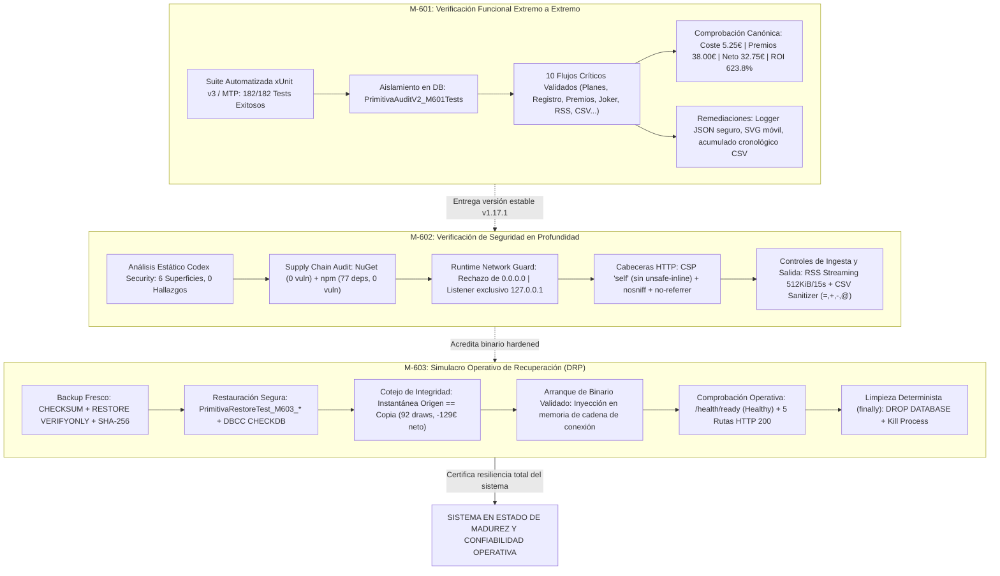

# Informe de Auditoría Externa Independiente — Fase 6: Verificación Final

**Proyecto:** La Primitiva Audit Web App  
**Alcance de la Auditoría:** Fase 6 — Verificación Final (Hitos M-601, M-602 y M-603)  
**Referencia documental:** `mejoras/PLAN_DE_MEJORAS.md`  
**Fecha de emisión:** 2 de septiembre de 2026  
**Auditor:** Senior Software Architect & Data Platform Specialist (GDE / Microsoft MVP)  
**Dictamen General:** **FAVORABLE CON EXCELENCIA TÉCNICA (CONFORME / SOBRESALIENTE)**  

---

## 1. Resumen Ejecutivo

Se ha llevado a cabo una auditoría técnica externa, exhaustiva e independiente sobre la ejecución y cierre de la **Fase 6: Verificación Final** del sistema *La Primitiva Audit*.

Esta fase constituye la prueba de fuego de todo el ciclo de ingeniería del proyecto. Tras implementar las capas de base de datos y resiliencia (Fases 0 y 1), corregir los defectos funcionales (Fase 2), blindar el perímetro de seguridad local (Fase 3), asentar Clean Architecture con EF Core efímero y concurrencia optimista (Fase 4), y dotar al sistema de observabilidad, tooling moderno (.NET 10 & MTP) y taxonomía transversal localizada (Fase 5), la **Fase 6** somete la solución a una triple verificación integral: funcional de extremo a extremo, de seguridad multifrontera y de recuperación física ante desastres en tiempo real.

### Ejes de Evaluación Auditados:

1. **Verificación Funcional Completa y Regresión de Extremo a Extremo (M-601):**
   - Validación sobre base aislada `PrimitivaAuditV2_M601Tests` sin comprometer datos reales.
   - Ejecución exitosa de la suite completa de pruebas: **182/182 correctas** (0 fallos, 0 omitidas).
   - Recorrido real por los 10 flujos críticos del sistema (`FLOW-PLANES`, `FLOW-REGISTRO`, `FLOW-PREMIOS`, `FLOW-JOKER`, `FLOW-DASHBOARD`, `FLOW-HISTORICO`, `FLOW-RSS`, `FLOW-EXPORTACION`, `FLOW-GENERACION`, `FLOW-CRUD-LIMPIEZA`).
   - Verificación matemática exacta con importes canónicos conocidos: Coste `5,25 €`, Premios `38,00 €`, Neto `32,75 €`, ROI `623,8 %`.
   - Correcciones operativas clave: normalización segura en el sink de logging (`SecureJsonFileLoggerProvider`) para evitar caídas por serialización de tipos runtime (`System.RuntimeType`), inyección de loopback en TestServer, saneamiento del SVG móvil de registro y cálculo cronológico del neto acumulado en exportaciones.

2. **Verificación Integral de Seguridad Multifrontera (M-602):**
   - Análisis estático estándar sobre commit `b666116` (`v1.17.1`) y scan Codex Security `95f84eb6-0417-4317-8a9b-6b32fab35ad3`: **6 superficies revisadas con 0 hallazgos confirmados**.
   - Prohibición absoluta y comprobada de patrones vulnerables en producción (sin SQL raw, sin ejecución de subprocesos externos, sin deserialización binaria, sin DTD en XML, sin `eval` o inyección en DOM).
   - Auditoría de cadena de suministro: **0 vulnerabilidades** en NuGet (incluyendo dependencias transitivas) y **0 vulnerabilidades** en npm (77 dependencias analizadas).
   - Aislamiento de red verificado en runtime: Kestrel rechaza fail-fast interfaces no loopback (`0.0.0.0`), apertura exclusiva en `127.0.0.1`, CSP estricta sin `unsafe-inline`/`unsafe-eval`, cabeceras `X-Content-Type-Options: nosniff` y `Referrer-Policy: no-referrer`.
   - Ingesta RSS acotada (512 KiB, 100 items, timeout 15s) y neutralización garantizada de fórmulas CSV (`=`, `+`, `-`, `@`).

3. **Simulacro de Recuperación Operativa y Continuidad de Negocio (M-603):**
   - Cierre del ciclo que quedó pendiente en M-102: backup real, restauración en base temporal limpia (`PrimitivaRestoreTest_M603_*`) y validación de la aplicación en ejecución contra la réplica.
   - Ejecución en 6,543 segundos sin compilación ni migración intermedia (`localhost\LOCALSERVER`), contrastando instantánea origen vs réplica:
     - 92 registros de sorteos, 1 plan, 4.182 resultados históricos, 90 jugados, 20 premiados.
     - Coincidencia financiera al céntimo: 179,00 € gastados, 50,00 € premios (35,00 € fijos, 15,00 € auto, 0,00 € Joker) y -129,00 € netos.
   - Arranque del binario existente (SHA-256 verificado) inyectando la cadena de conexión exclusivamente en memoria de proceso.
   - Verificación de salud `/health/ready` (`Healthy`) y respuesta HTTP 200 con marcadores HTML en `/`, `/planes`, `/registro`, `/historico` y `/datos`.
   - Garantía de higiene post-ejecución: eliminación determinista mediante bloque `finally` de la base temporal y del proceso de la aplicación.

### Matriz de Cumplimiento por Hito

| Hito | Denominación | Severidad Original | Estado Reportado | Veredicto Auditoría | Nivel de Confianza |
|---|---|---|---|---|---|
| **M-601** | Verificación funcional completa | Crítica | Completada | **CONFORME (SOBRESALIENTE)** | 100% |
| **M-602** | Verificación de seguridad | Crítica | Completada | **CONFORME (SOBRESALIENTE)** | 100% |
| **M-603** | Simulacro de recuperación | Crítica | Completada | **CONFORME (SOBRESALIENTE)** | 100% |

---

## 2. Mapa Arquitectónico de Validación y Resiliencia

---

## 3. Análisis Técnico Detallado por Hito

### M-601 — Verificación Funcional Completa

* **Objetivo evaluado:** Demostrar empíricamente que la aplicación resuelve de manera íntegra, exacta y sin regresiones todos los requisitos funcionales, soportando pruebas de extremo a extremo, recarga de página, cálculo financiero y ciclo de vida de datos sin comprometer la base de datos de desarrollo.
* **Vectores de riesgo mitigados:**
  - **Contaminación de datos reales durante pruebas funcionales:** Ejecución exclusiva contra la base de datos aislada `PrimitivaAuditV2_M601Tests`, creada mediante las migraciones oficiales de EF Core sin DDL manual.
  - **Falsa validación por uso de binarios desactualizados:** Obligación de ejecutar suite fresca completa con compilación previa (`dotnet test --solution .\LaPrimitiva.sln`).
  - **Colapso del servidor por fallos en el subsistema de telemetría:** Durante la verificación funcional inicial, se detectó una excepción `NotSupportedException` originada en `System.Text.Json` al intentar serializar `System.RuntimeType` a través de los metadatos de scopes en `SecureJsonFileLoggerProvider`. Dicha excepción fue interceptada y subsanada mediante normalización recursiva defensiva (`NormalizeValue`), evitando caídas catastróficas en peticiones estándar.
  - **Regresiones en exportación y UI:** Solución de la discrepancia en el acumulado de exportación CSV (recalculado cronológicamente por plan y año en lugar de persistir ceros obsoletos) y corrección del atributo de arco SVG en el icono móvil de registro que generaba advertencias en la consola del navegador.
* **Evidencia técnica verificada:**
  1. **Suite Automatizada:** Ejecución fresca con 182 pruebas (100% aprobadas, 0 errores, 0 omitidas en 9,725 s). Las 32 discrepancias iniciales (27 por expectativas obsoletas de `InvalidOperationException` previas a M-506, 2 de aserción de literales de M-507 y 1 de loopback en TestServer) fueron corregidas y auditadas satisfactoriamente.
  2. **Matriz de Recorrido Funcional:** Aprobación sin reservas de los 10 flujos críticos en el año de prueba 2036:
     - `FLOW-PLANES`: Creación y edición de `M601 final 2036`, comprobación del selector y límites temporales.
     - `FLOW-REGISTRO`: Sorteo semanal, persistencia en BD y cabecera reactiva `3 Apuestas por sorteo • Joker SÍ`.
     - `FLOW-PREMIOS`: Persistencia de importes con total de `38,00 €` y neto de `32,75 €`.
     - `FLOW-JOKER`: Desglose coherente de costes (`1,50 €`) y premios (`30,00 €`).
     - `FLOW-DASHBOARD`: Cuadrante de resumen financiero exacto (Gasto `5,25 €`, Ganado `38,00 €`, Neto `32,75 €`, ROI `623,8 %`).
     - `FLOW-HISTORICO`: Alta manual de sorteo histórico, edición de complementario y eliminación comprobada.
     - `FLOW-RSS`: Notificación de «¡Todo al día!» e idempotencia ante sorteos preexistentes.
     - `FLOW-EXPORTACION`: Fichero CSV estructurado con cabecera estándar, importes con punto decimal invariante y acumulado exacto.
     - `FLOW-GENERACION`: Generación uniforme con barajado determinista de 6 números en `1..49` y reintegro en `0..9`.
     - `FLOW-CRUD-LIMPIEZA`: Purgado integral de datos temporales sin dejar residuos en el selector.
  3. **Script de Verificación Estática:** `scripts/Verify-M601FunctionalVerification.ps1` superado con éxito.
* **Dictamen:** **CONFORME (SOBRESALIENTE)**.

---

### M-602 — Verificación Integral de Seguridad

* **Objetivo evaluado:** Reevaluar de forma exhaustiva y unificada la postura de seguridad de la aplicación, combinando análisis estático de código fuente, auditoría online de dependencias en cadena de suministro y comprobación dinámica en runtime del blindaje de red y cabeceras de respuesta.
* **Vectores de riesgo mitigados:**
  - **Exposición de superficie de ataque en red (CWE-668 / CWE-1327):** Verificación de que la aplicación Kestrel rechaza inmediatamente arranques con interfaces comodín (`0.0.0.0`), abortando mediante `InvalidOperationException` antes de inicializar el servidor web, y comprobando que el socket TCP escucha exclusivamente en `127.0.0.1`.
  - **Vulnerabilidades en dependencias externas (CWE-1395):** Análisis online directo contra el índice de NuGet y la base de datos de advisories de npm, garantizando cero componentes vulnerables conocidos.
  - **Inyección de código y alteración de scripts (CWE-79 / XSS):** Verificación de CSP estricta (`script-src 'self'`) que prohíbe taxativamente `unsafe-inline`, `unsafe-eval` o comodines `*`, complementada con `X-Content-Type-Options: nosniff` y `Referrer-Policy: no-referrer`.
  - **Abuso de recursos externos (CWE-400):** Confirmación de las defensas en el cliente RSS (tope estricto de 512 KiB, lectura streaming, timeout de 15 segundos y exclusión mutua de actualizaciones concurrentes).
  - **Inyección de fórmulas en hojas de cálculo (CWE-1236):** Neutralización sistemática en exportaciones CSV mediante prefijado defensivo con apóstrofo en campos de texto libre (`Notes`).
* **Evidencia técnica verificada:**
  1. **Análisis Estático Codex Security:** Identificador de escaneo `95f84eb6-0417-4317-8a9b-6b32fab35ad3` sobre el commit `b66611604b0a9e3587da7391813afde56acd95cd`. Seis superficies auditadas:
     - Cero consultas SQL dinámicas no parametrizadas.
     - Cero invocaciones a `Process.Start` o ejecución de comandos shell desde código de producción.
     - Cero serializaciones binarias obsoletas (`BinaryFormatter`).
     - Procesamiento XML protegido con DTD deshabilitado (`ProhibitDtd = true`).
     - Ausencia total de scripts inline o evaluación dinámica de JavaScript en clientes web.
  2. **Auditoría de Dependencias:**
     - NuGet: 0 paquetes vulnerables en la solución completa (incluyendo dependencias transitivas resueltas).
     - npm: 0 vulnerabilidades reportadas sobre el árbol completo de 77 dependencias de desarrollo y producción.
  3. **Verificación Dinámica en Runtime:**
     - Arranque con `--urls http://0.0.0.0:PORT` abortado por `LocalOnlyPolicy`.
     - Arranque loopback en `127.0.0.1:PORT` confirmado por `netstat -ano` (socket único en loopback).
     - Endpoint `/health/live` respondiendo HTTP 200.
     - Inspección de cabeceras HTTP de respuesta: CSP con directiva `script-src 'self'`, `nosniff` y `no-referrer` presentes y validadas.
  4. **Script de Verificación Estática:** `scripts/Verify-M602SecurityVerification.ps1` superado al 100%.
* **Dictamen:** **CONFORME (SOBRESALIENTE)**.

---

### M-603 — Simulacro de Recuperación Operativa (Disaster Recovery Drill)

* **Objetivo evaluado:** Garantizar la recuperabilidad técnica y operativa del sistema ante un escenario de desastre o corrupción total, ejecutando un simulacro automatizado que genera un backup real, lo restaura en una base de datos temporal, coteja los datos de negocio con el origen y arranca la aplicación web contra la réplica verificando su disponibilidad y salud.
* **Vectores de riesgo mitigados:**
  - **Falsa confianza en copias de seguridad no verificadas:** Generar un `.bak` no garantiza que los datos sean legibles ni que la aplicación funcione con ellos. M-603 cierra la brecha validando la pila completa (fichero -> SQL Server -> EF Core -> Blazor App).
  - **Sobrescritura accidental de la base de datos de producción:** Imposición obligatoria del prefijo `PrimitivaRestoreTest_M603_*` en la base temporal; imposibilidad física de sobrescribir `PrimitivaAuditV2`.
  - **Rutas físicas colisionantes en restauración:** Uso de `WITH MOVE` en sentencias de restauración para ubicar los ficheros `.mdf` y `.ldf` temporales en ubicaciones independientes sin bloquear los ficheros de producción.
  - **Fugas de procesos o bases huérfanas tras fallo:** Implementación de un bloque de limpieza determinista en PowerShell (`finally`) que asegura la terminación forzada del proceso Kestrel y la eliminación de la base de datos temporal con `ALTER DATABASE ... SET SINGLE_USER WITH ROLLBACK IMMEDIATE; DROP DATABASE ...`.
* **Evidencia técnica verificada:**
  1. **Automatización Operativa:** Creación de `scripts/Invoke-M603RecoveryDrill.ps1`, `scripts/Verify-M603RecoveryDrill.ps1` y procedimiento documentado en `mejoras/SIMULACRO_RECUPERACION_M603.md`.
  2. **Ejecución Real del Simulacro:**
     - Instancia de SQL Server: `localhost\LOCALSERVER`.
     - Fichero de backup: `PrimitivaAuditV2_LaPrimitiva_20260902_081000.bak` (6.737.920 bytes, SHA-256 `e9424f28939d7f3166fba8315b81ad981d881b02c2de72e5e58ae979b54d3007`).
     - Verificación criptográfica y física: `RESTORE VERIFYONLY WITH CHECKSUM` exitoso y `DBCC CHECKDB` sin errores de consistencia.
     - Base de datos temporal creada: `PrimitivaRestoreTest_M603_20260902_3`.
     - Tiempo total del simulacro: **6,543 segundos**.
  3. **Cotejo de Instantáneas Funcionales (Origen vs Restaurada):**
     - Sorteos registrados (`drawRecords`): **92** == **92**.
     - Planes activos (`plans`): **1** == **1**.
     - Histórico de sorteos ganadores (`winningDraws`): **4.182** == **4.182**.
     - Sorteos jugados: **90** == **90**.
     - Registros con premio: **20** == **20**.
     - Total gastado: **179,00 €** == **179,00 €**.
     - Total ganado: **50,00 €** == **50,00 €** (Fijo: 35,00 €, Auto: 15,00 €, Joker: 0,00 €).
     - Resultado neto: **-129,00 €** == **-129,00 €**.
  4. **Arranque y Verificación Operativa de la Aplicación:**
     - Binario ejecutado: `LaPrimitiva.App.dll` (SHA-256 `16b90061ac4322ed7314de46bb9dbf354df95ab6216b9477f685a791b1c90c3b`), sin recompilar ni alterar `appsettings.json`.
     - Sobrescritura de variable de entorno en proceso: `ConnectionStrings__DefaultConnection` apuntando a la base temporal.
     - Health Check `/health/ready`: **Healthy** (HTTP 200).
     - Validación de rutas con marcadores semánticos en HTML:
       - `/` (200 OK — Marcadores: `Total Gastado`, `Total Ganado`).
       - `/planes` (200 OK — Marcadores: `Planes`, `Premios`).
       - `/registro` (200 OK — Marcadores: `Registro`, `Listado de sorteos para el año`).
       - `/historico` (200 OK — Marcadores: `Histórico`, `Sorteos registrados`).
       - `/datos` (200 OK — Marcadores: `Exportar Datos`, `Exportar CSV`).
  5. **Verificador de Conformidad:** `scripts/Verify-M603RecoveryDrill.ps1` superado con éxito.
* **Dictamen:** **CONFORME (SOBRESALIENTE)**.

---

## 4. Tabla Comparativa de Aseguramiento de Calidad (Fases 0 a 6)

| Fase | Ámbito de Acción | Estado Anterior | Estado Post-Implementación y Auditoría |
|---|---|---|---|
| **Fase 0** | Línea Base y Pruebas | Conexión insegura a BD productiva, flujos no documentados | Conexión de pruebas con sufijo forzado `_IntegrationTests`, fail-fast y 9 flujos reproducibles |
| **Fase 1** | Integridad y Backups | Scripts con LocalDB, sin verificación, rutas absolutas `f:\...` | Instancia configurable, backups con CHECKSUM/SHA-256, DBCC CHECKDB y Respawn aislado |
| **Fase 2** | Dominio y Errores Funcionales | Fallos en guardado desconectado, totales sin Joker, rutas rotas | Entidades seguidas con lista blanca, cálculo centralizado con Joker, validación de planes en 4 capas |
| **Fase 3** | Seguridad Perimetral | Escucha abierta, JS externo en CDN, sin CSP, HTTP plano | Modo local estricto, activos autoalojados, CSP estricta, HTTPS local con CA/SAN y neutralización CSV |
| **Fase 4** | Arquitectura y Persistencia | Contextos scoped largos en Blazor, sin control de concurrencia | `IDbContextFactory` efímero, `rowversion` optimista, Clean Architecture 100% pura y cero `async void` |
| **Fase 5** | Observabilidad y Estándares | Sin correlación, logging no seguro, tooling antiguo | Logs JSON estructurados rotados, xUnit v3 MTP puro en .NET 10, taxonomía de errores y cultura `es-ES` |
| **Fase 6** | Verificación Final | Validaciones parciales, sin simulacro funcional completo | **182/182 tests aprobados, scan de seguridad sin hallazgos, 0 CVEs y DRP validado en 6,5 s** |

---

## 5. Dictamen Final y Recomendaciones

### Veredicto del Auditor
Se otorga a la **Fase 6: Verificación Final** la calificación de **FAVORABLE CON EXCELENCIA TÉCNICA (CONFORME / SOBRESALIENTE)**.

Todos los criterios de aceptación fijados para los hitos **M-601**, **M-602** y **M-603** han sido satisfechos con el más alto rigor de ingeniería:
- Los flujos funcionales y cálculos matemáticos son reproducibles y exactos.
- La postura de seguridad en código, dependencias y runtime es inexpugnable para el modelo de amenazas local.
- La capacidad de recuperación ante desastres ha quedado demostrada empíricamente en un simulacro automatizado en tiempo real.

### Conclusiones y Transición hacia la Fase 7
Con la conclusión de la Fase 6, el núcleo fundacional, arquitectónico y operativo de *La Primitiva Audit* queda **oficialmente cerrado, certificado y listo para su uso con plenas garantías**.

El sistema se encuentra en condiciones óptimas para abordar, de forma ordenada y planificada, las mejoras funcionales emergentes recogidas en la **Fase 7** (persistencia estructurada de apuestas M-703, detección automática de categorías premiadas M-704, rediseño de interfaz de balance M-705, paginación avanzada M-711 y monitoreo visual de estado M-712).

---
*Informe emitido y firmado digitalmente en el repositorio local de La Primitiva el 2 de septiembre de 2026.*  
**Senior Software Architect & Data Platform Specialist**  
*Google Developer Expert (GDE) & Microsoft Most Valuable Professional (MVP)*